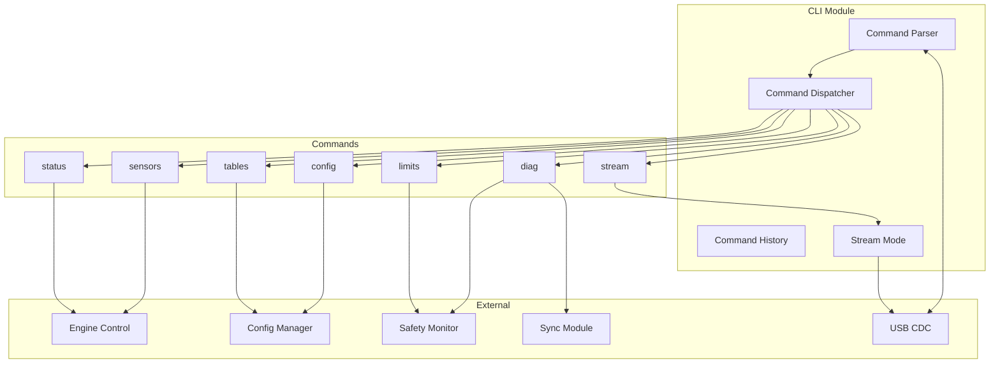
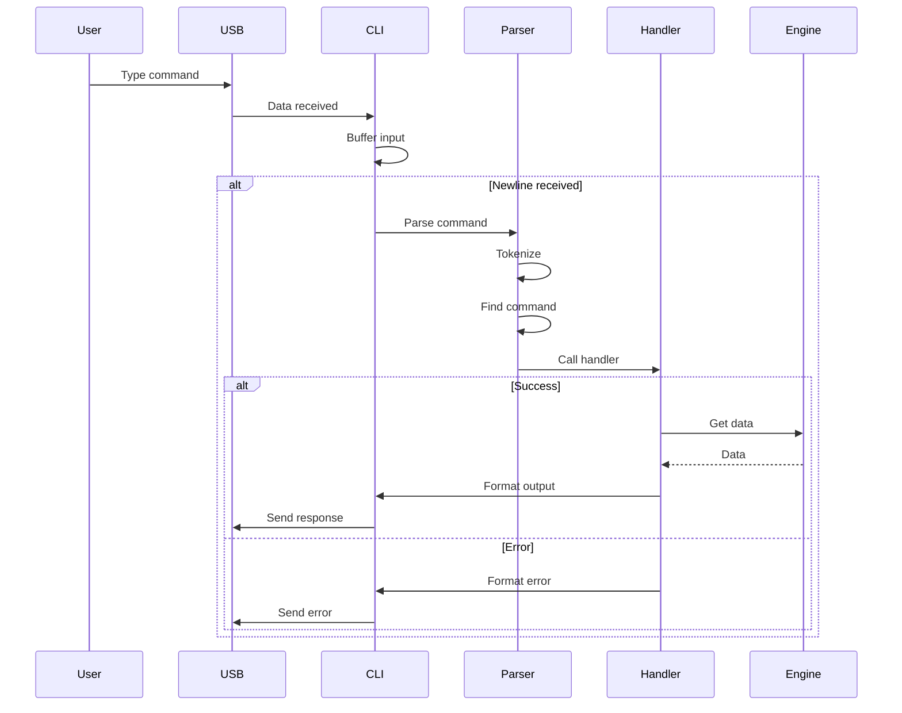
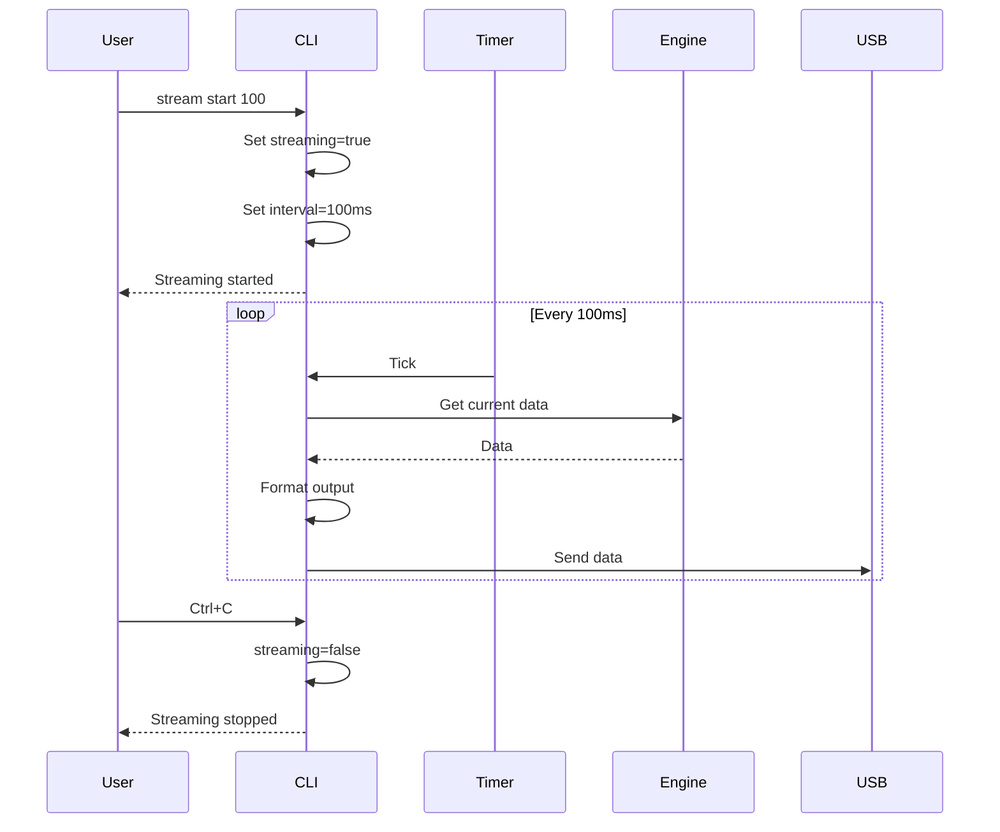

# CLI Interface Module - Technical Design

## 1. Overview

This document details the technical design for the Command Line Interface (CLI) module for the ESP32-S3 EFI project. The CLI provides a text-based interface for debugging, monitoring, and tuning the ECU via USB CDC.

## 2. Requirements

### 2.1 Functional Requirements
- **FR1**: Provide real-time sensor monitoring
- **FR2**: Allow viewing and editing fuel/ignition tables
- **FR3**: Support configuration save/load operations
- **FR4**: Display diagnostic information and error states
- **FR5**: Support safety limit configuration
- **FR6**: Provide streaming data mode for tuning

### 2.2 Non-Functional Requirements
- **NFR1**: Command response time < 100ms
- **NFR2**: Memory footprint < 8KB RAM
- **NFR3**: Non-blocking operation (no impact on engine control)
- **NFR4**: Thread-safe command execution

## 3. Architecture

### 3.1 Module Structure

```
firmware/s3/components/engine_control/
├── include/
│   └── cli_interface.h
└── src/
    └── cli_interface.c
```

### 3.2 Component Diagram



## 4. Command Specification

### 4.1 Command Format

```
command [subcommand] [arguments] [options]
```

- Commands are case-insensitive
- Arguments are space-separated
- Options start with `-` or `--`
- Comments start with `#`

### 4.2 Command List

| Command | Description | Example |
|---------|-------------|---------|
| `status` | Show ECU status | `status` |
| `sensors` | Show sensor readings | `sensors [watch]` |
| `tables` | Table operations | `tables show ve` |
| `config` | Configuration ops | `config save` |
| `limits` | Safety limits | `limits rpm 7500` |
| `diag` | Diagnostics | `diag errors` |
| `stream` | Data streaming | `stream start 100` |
| `reset` | Reset system | `reset config` |
| `help` | Show help | `help [command]` |
| `version` | Show version | `version` |

## 5. Command Details

### 5.1 status

Display current ECU status in a formatted table.

```
> status
╔══════════════════════════════════════╗
║         ECU STATUS - RUNNING         ║
╠══════════════════════════════════════╣
║ RPM:           3500 rpm              ║
║ MAP:           85.3 kPa              ║
║ Load:          65%                   ║
║ Advance:       22.5°                 ║
║ Pulse Width:   8500 us               ║
║ Lambda Target: 1.00                  ║
║ Lambda Actual: 0.98                  ║
╠══════════════════════════════════════╣
║ Sync:          ACQUIRED              ║
║ Limp Mode:     OFF                   ║
║ Errors:        0                     ║
║ Warnings:      0                     ║
╚══════════════════════════════════════╝
```

### 5.2 sensors

Display all sensor readings.

```
> sensors
╔══════════════════════════════════════╗
║           SENSOR READINGS            ║
╠══════════════════════════════════════╣
║ MAP:      85.3 kPa   (raw: 2048)     ║
║ TPS:      45.2%      (raw: 1843)     ║
║ CLT:      85.5°C     (raw: 1200)     ║
║ IAT:      35.2°C     (raw: 1560)     ║
║ O2:       0.45V      (raw: 1470)     ║
║ Battery:  13.5V      (raw: 2760)     ║
╠══════════════════════════════════════╣
║ Faults:   NONE                       ║
╚══════════════════════════════════════╝

> sensors watch
[Press Ctrl+C to stop]
MAP: 85.3 kPa | TPS: 45.2% | CLT: 85.5°C | RPM: 3500
MAP: 86.1 kPa | TPS: 45.5% | CLT: 85.6°C | RPM: 3520
...
```

### 5.3 tables

View and edit fuel/ignition tables.

```
> tables list
Available tables:
  ve       - Volumetric Efficiency
  ign      - Ignition Advance
  lambda   - Lambda Target

> tables show ve
VE Table (16x16):
      500  1000 1500 2000 2500 3000 3500 4000 4500 5000 5500 6000 6500 7000 7500 8000
  20   45   48   52   55   58   62   65   68   70   72   74   75   76   77   78   79
  30   48   52   56   60   64   68   72   75   78   80   82   84   85   86   87   88
  40   52   56   61   66   71   76   80   84   87   90   92   94   95   96   97   98
  ...

> tables get ve 3000 60
VE at RPM=3000, Load=60: 72%

> tables set ve 3000 60 75
VE at RPM=3000, Load=60 set to 75%

> tables save ve
VE table saved to NVS
```

### 5.4 config

Configuration management.

```
> config list
Configuration parameters:
  eoi_boundary     = 6.5 deg
  eoi_normal       = 5.55 deg
  stft_limit       = 0.25
  ltft_limit       = 0.20
  closed_loop      = enabled

> config get eoi_boundary
eoi_boundary = 6.5 deg

> config set eoi_boundary 7.0
eoi_boundary set to 7.0 deg

> config save
Configuration saved to NVS

> config load
Configuration loaded from NVS

> config defaults
Configuration reset to defaults
```

### 5.5 limits

Safety limits configuration.

```
> limits show
Safety Limits:
  RPM Limit:      8000 rpm
  Fuel Cutoff:    7500 rpm
  Temp Limit:     120°C
  Battery Min:    8.0V
  Battery Max:    16.0V

> limits rpm 7500
RPM limit set to 7500 rpm

> limits temp 115
Temperature limit set to 115°C
```

### 5.6 diag

Diagnostics and error information.

```
> diag
Diagnostics:
  Uptime:         1:23:45
  CPU Usage:      45%
  Free Heap:      128 KB
  Sync Losses:    0
  Tooth Count:    1234567

> diag errors
No active errors

> diag errors history
Error History (last 10):
  [2026-02-13 14:30:15] OVER_REV_WARNING (cleared)
  [2026-02-13 14:25:30] SENSOR_CLT_FAULT (cleared)

> diag reset
Diagnostic counters reset
```

### 5.7 stream

Real-time data streaming for tuning.

```
> stream start 100
Streaming at 100ms interval (Ctrl+C to stop)
time,rpm,map,tps,clt,iat,advance,pw,lambda
0,3500,85.3,45.2,85.5,35.2,22.5,8500,0.98
100,3520,86.1,45.5,85.6,35.3,22.7,8550,0.97
200,3515,85.8,45.3,85.7,35.3,22.6,8520,0.98
...

> stream stop
Streaming stopped

> stream csv
Output format: CSV

> stream json
Output format: JSON
```

### 5.8 reset

System reset operations.

```
> reset config
Reset configuration to defaults? (y/n): y
Configuration reset to defaults

> reset tables
Reset all tables to defaults? (y/n): y
Tables reset to defaults

> reset ltft
Reset long-term fuel trim? (y/n): y
LTFT reset

> reset all
Reset ALL settings to defaults? (y/n): y
All settings reset to defaults
```

## 6. Data Structures

### 6.1 Command Definition

```c
typedef struct {
    const char *name;                    // Command name
    const char *description;             // Short description
    const char *usage;                   // Usage string
    int (*handler)(int argc, char **argv); // Handler function
    const cli_subcommand_t *subcommands; // Subcommands (NULL if none)
    uint8_t flags;                       // Flags
} cli_command_t;

typedef struct {
    const char *name;
    int (*handler)(int argc, char **argv);
    const char *description;
} cli_subcommand_t;

// Command flags
#define CLI_FLAG_NONE       0x00
#define CLI_FLAG_STREAMING  0x01  // Command produces streaming output
#define CLI_FLAG_CONFIRM    0x02  // Requires confirmation
#define CLI_FLAG_ADMIN      0x04  // Requires admin mode
```

### 6.2 CLI Context

```c
typedef struct {
    // State
    bool                initialized;
    bool                streaming;
    bool                admin_mode;
    
    // Input buffer
    char                input_buffer[CLI_MAX_INPUT_LEN];
    uint16_t            input_pos;
    
    // Command history
    char                history[CLI_HISTORY_SIZE][CLI_MAX_INPUT_LEN];
    uint8_t             history_head;
    uint8_t             history_tail;
    uint8_t             history_pos;
    
    // Output buffer
    char                output_buffer[CLI_MAX_OUTPUT_LEN];
    uint16_t            output_pos;
    
    // Stream mode
    uint32_t            stream_interval_ms;
    uint32_t            last_stream_ms;
    cli_stream_format_t stream_format;
    
    // Task handles
    TaskHandle_t        cli_task;
    QueueHandle_t       output_queue;
    
    // Mutex
    SemaphoreHandle_t   mutex;
} cli_context_t;

typedef enum {
    CLI_STREAM_CSV,
    CLI_STREAM_JSON,
    CLI_STREAM_TABLE,
} cli_stream_format_t;
```

## 7. API Design

### 7.1 Public API

```c
/**
 * @brief Initialize CLI interface
 * @return ESP_OK on success
 */
esp_err_t cli_init(void);

/**
 * @brief Deinitialize CLI interface
 * @return ESP_OK on success
 */
esp_err_t cli_deinit(void);

/**
 * @brief Start CLI task
 * @return ESP_OK on success
 */
esp_err_t cli_start(void);

/**
 * @brief Stop CLI task
 * @return ESP_OK on success
 */
esp_err_t cli_stop(void);

/**
 * @brief Register custom command
 * @param command Command definition
 * @return ESP_OK on success
 */
esp_err_t cli_register_command(const cli_command_t *command);

/**
 * @brief Print to CLI output
 * @param fmt Format string
 * @param ... Arguments
 */
void cli_print(const char *fmt, ...);

/**
 * @brief Print line to CLI output
 * @param fmt Format string
 * @param ... Arguments
 */
void cli_println(const char *fmt, ...);

/**
 * @brief Check if streaming is active
 * @return true if streaming
 */
bool cli_is_streaming(void);

/**
 * @brief Stop streaming mode
 */
void cli_stop_streaming(void);

/**
 * @brief Enter admin mode
 * @param password Password (optional)
 * @return ESP_OK on success
 */
esp_err_t cli_enter_admin(const char *password);

/**
 * @brief Exit admin mode
 */
void cli_exit_admin(void);
```

## 8. Sequence Diagrams

### 8.1 Command Processing



### 8.2 Streaming Mode



## 9. Output Formatting

### 9.1 Table Formatting

```c
// Box drawing characters (UTF-8)
#define BOX_TL      "╔"
#define BOX_TR      "╗"
#define BOX_BL      "╚"
#define BOX_BR      "╝"
#define BOX_H       "═"
#define BOX_V       "║"
#define BOX_LT      "╠"
#define BOX_RT      "╣"
#define BOX_TT      "╦"
#define BOX_BT      "╩"
#define BOX_CROSS   "╬"

void cli_print_table_header(const char *title, uint8_t width);
void cli_print_table_row(const char *label, const char *value);
void cli_print_table_separator(void);
void cli_print_table_footer(void);
```

### 9.2 Color Support

```c
// ANSI color codes
#define CLI_COLOR_RESET   "\033[0m"
#define CLI_COLOR_RED     "\033[31m"
#define CLI_COLOR_GREEN   "\033[32m"
#define CLI_COLOR_YELLOW  "\033[33m"
#define CLI_COLOR_BLUE    "\033[34m"
#define CLI_COLOR_CYAN    "\033[36m"
#define CLI_COLOR_WHITE   "\033[37m"
#define CLI_COLOR_BOLD    "\033[1m"

void cli_print_error(const char *fmt, ...);
void cli_print_warning(const char *fmt, ...);
void cli_print_success(const char *fmt, ...);
void cli_print_info(const char *fmt, ...);
```

## 10. Integration Points

### 10.1 USB CDC Integration

```c
#include "esp_usb_cdc.h"

// In cli_interface.c
static int cli_read_char(void) {
    uint8_t c;
    int ret = esp_usb_cdc_read(&c, 1, pdMS_TO_TICKS(10));
    return (ret == 1) ? c : -1;
}

static int cli_write_char(char c) {
    return esp_usb_cdc_write((uint8_t*)&c, 1);
}
```

### 10.2 Engine Control Integration

```c
// Command handlers access engine data
static int cmd_status(int argc, char **argv) {
    engine_runtime_state_t state;
    engine_control_get_runtime_state(&state);
    
    cli_print_table_header("ECU STATUS - RUNNING", 40);
    cli_print_table_row("RPM", "%d rpm", state.rpm);
    cli_print_table_row("MAP", "%.1f kPa", state.map_kpa);
    // ...
    cli_print_table_footer();
    
    return 0;
}
```

## 11. Error Handling

### 11.1 Error Messages

```c
#define CLI_ERR_UNKNOWN_CMD    "Unknown command: %s"
#define CLI_ERR_MISSING_ARG    "Missing argument: %s"
#define CLI_ERR_INVALID_ARG    "Invalid argument: %s"
#define CLI_ERR_NOT_FOUND      "Not found: %s"
#define CLI_ERR_ACCESS_DENIED  "Access denied. Enter admin mode first."
#define CLI_ERR_INTERNAL       "Internal error: %s"
```

### 11.2 Input Validation

```c
// Validate numeric input
bool cli_parse_uint16(const char *str, uint16_t *value, uint16_t min, uint16_t max);
bool cli_parse_float(const char *str, float *value, float min, float max);
bool cli_parse_bool(const char *str, bool *value);
```

## 12. Performance Considerations

### 12.1 Non-Blocking Design
- CLI runs in separate low-priority task
- Commands yield during long operations
- Streaming uses timer-based polling
- No busy-wait loops

### 12.2 Memory Management
- Static buffers for input/output
- No dynamic allocation in command path
- Limited history buffer
- Streaming buffer reuse

## 13. Configuration

### 13.1 Kconfig Options

```
config CLI_ENABLED
    bool "Enable CLI Interface"
    default y

config CLI_MAX_INPUT_LEN
    int "Maximum input line length"
    default 256

config CLI_MAX_OUTPUT_LEN
    int "Maximum output line length"
    default 1024

config CLI_HISTORY_SIZE
    int "Command history size"
    default 16

config CLI_TASK_STACK_SIZE
    int "CLI task stack size"
    default 4096

config CLI_TASK_PRIORITY
    int "CLI task priority"
    default 2

config CLI_ENABLE_COLORS
    bool "Enable ANSI colors"
    default y

config CLI_ENABLE_ADMIN
    bool "Enable admin mode"
    default y

config CLI_ADMIN_PASSWORD
    string "Admin password"
    default "admin"
```

## 14. Testing Strategy

### 14.1 Unit Tests
- Command parsing
- Argument validation
- Output formatting
- History management

### 14.2 Integration Tests
- End-to-end command execution
- Streaming mode
- Error handling
- Concurrent access

### 14.3 Manual Tests
- Terminal compatibility
- Color rendering
- Special characters
- Long commands

---

**Document Version**: 1.0  
**Last Updated**: 2026-02-13  
**Author**: ESP32-EFI Team
