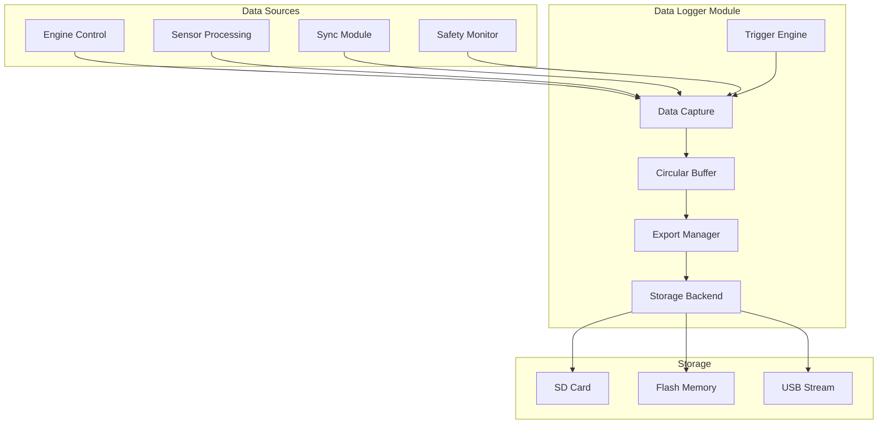
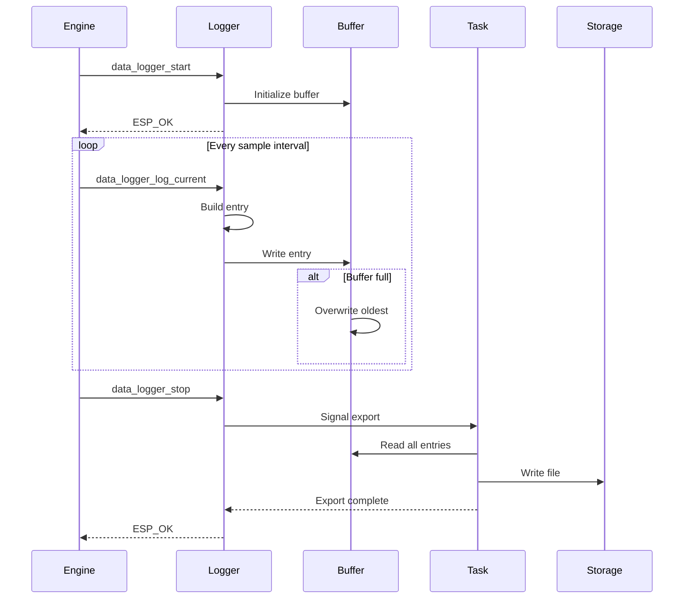
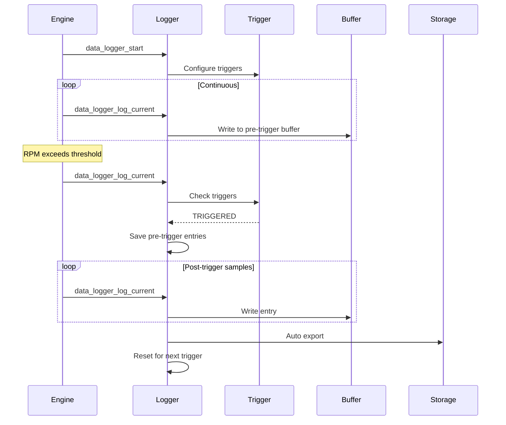

# Data Logger Module - Technical Design

## 1. Overview

This document details the technical design for the Data Logger module for the ESP32-S3 EFI project. The data logger provides recording capabilities for performance analysis, tuning, and diagnostics.

## 2. Requirements

### 2.1 Functional Requirements
- **FR1**: Record engine and sensor data at configurable rates
- **FR2**: Support circular buffer for continuous logging
- **FR3**: Export data in CSV and binary formats
- **FR4**: Support trigger-based logging (RPM, error, manual)
- **FR5**: Provide real-time streaming to external storage
- **FR6**: Support SD card storage when available

### 2.2 Non-Functional Requirements
- **NFR1**: Logging overhead < 2% CPU
- **NFR2**: Memory footprint < 16KB RAM
- **NFR3**: No impact on engine control timing
- **NFR4**: Support minimum 1kHz sample rate

## 3. Architecture

### 3.1 Module Structure

```
firmware/s3/components/engine_control/
├── include/
│   └── data_logger.h
└── src/
    └── data_logger.c
```

### 3.2 Component Diagram



## 4. Data Structures

### 4.1 Log Entry

```c
typedef struct __attribute__((packed)) {
    uint32_t    timestamp_ms;     // System timestamp
    uint16_t    rpm;              // Engine RPM
    uint16_t    map_kpa10;        // MAP * 10
    uint16_t    tps_pct10;        // TPS * 10
    int16_t     clt_c10;          // CLT * 10
    int16_t     iat_c10;          // IAT * 10
    uint16_t    o2_mv;            // O2 voltage
    uint16_t    vbat_mv;          // Battery voltage
    uint16_t    advance_deg10;    // Ignition advance * 10
    uint16_t    pw_us;            // Injection pulse width
    uint16_t    lambda_target;    // Lambda target * 1000
    uint16_t    lambda_measured;  // Lambda measured * 1000
    uint8_t     sync_status;      // Sync state
    uint8_t     flags;            // Status flags
    uint16_t    error_bitmap;     // Active errors
} log_entry_t;

#define LOG_ENTRY_SIZE  sizeof(log_entry_t)  // 28 bytes
```

### 4.2 Log Session

```c
typedef struct {
    uint32_t    session_id;       // Unique session ID
    uint32_t    start_time;       // Session start timestamp
    uint32_t    end_time;         // Session end timestamp
    uint32_t    entry_count;      // Number of entries
    uint32_t    trigger_type;     // What triggered logging
    char        name[32];         // Session name
    uint8_t     format;           // Log format
    uint8_t     compression;      // Compression type
    uint16_t    sample_rate_hz;   // Sample rate
    uint32_t    crc32;            // CRC for integrity
} log_session_header_t;
```

### 4.3 Circular Buffer

```c
typedef struct {
    log_entry_t *buffer;          // Buffer memory
    uint32_t    capacity;         // Number of entries
    uint32_t    head;             // Write position
    uint32_t    tail;             // Read position
    uint32_t    count;            // Current entry count
    bool        overwrite;        // Overwrite when full
    SemaphoreHandle_t mutex;      // Thread safety
} log_circular_buffer_t;
```

### 4.4 Trigger Configuration

```c
typedef enum {
    LOG_TRIGGER_NONE       = 0,
    LOG_TRIGGER_RPM_ABOVE  = (1 << 0),  // RPM above threshold
    LOG_TRIGGER_RPM_BELOW  = (1 << 1),  // RPM below threshold
    LOG_TRIGGER_ERROR      = (1 << 2),  // On error condition
    LOG_TRIGGER_WARNING    = (1 << 3),  // On warning condition
    LOG_TRIGGER_TPS_CHANGE = (1 << 4),  // TPS change rate
    LOG_TRIGGER_MAP_CHANGE = (1 << 5),  // MAP change rate
    LOG_TRIGGER_MANUAL     = (1 << 6),  // Manual trigger
    LOG_TRIGGER_SYNC_LOSS  = (1 << 7),  // Sync loss event
} log_trigger_type_t;

typedef struct {
    uint16_t    trigger_mask;     // Active triggers
    uint16_t    rpm_high;         // RPM high threshold
    uint16_t    rpm_low;          // RPM low threshold
    uint16_t    tps_delta;        // TPS change threshold
    uint16_t    map_delta;        // MAP change threshold
    uint16_t    pre_trigger_samples; // Samples before trigger
    uint16_t    post_trigger_samples; // Samples after trigger
} log_trigger_config_t;
```

### 4.5 Logger Configuration

```c
typedef struct {
    // General settings
    bool        enabled;
    uint16_t    sample_rate_hz;   // 1-1000 Hz
    uint8_t     format;           // CSV, binary, or both
    uint8_t     storage_backend;  // SD card, flash, or stream
    
    // Buffer settings
    uint32_t    buffer_size;      // Number of entries
    
    // Trigger settings
    log_trigger_config_t trigger;
    
    // Export settings
    bool        auto_export;      // Auto export on session end
    uint32_t    max_session_size; // Max entries per session
    
    // File naming
    char        prefix[16];       // File name prefix
    bool        include_date;     // Include date in filename
} log_config_t;
```

### 4.6 Logger State

```c
typedef struct {
    // State
    bool                initialized;
    bool                logging;
    log_config_t        config;
    
    // Buffer
    log_circular_buffer_t buffer;
    log_entry_t         *buffer_memory;
    
    // Session
    log_session_header_t session;
    uint32_t            session_start_ms;
    
    // Statistics
    uint32_t            total_entries;
    uint32_t            dropped_entries;
    uint32_t            sessions_count;
    uint32_t            bytes_written;
    
    // Trigger state
    uint16_t            last_rpm;
    uint16_t            last_tps;
    uint16_t            last_map;
    bool                trigger_active;
    uint32_t            pre_trigger_count;
    uint32_t            post_trigger_count;
    
    // Task
    TaskHandle_t        logger_task;
    QueueHandle_t       entry_queue;
    
    // Mutex
    SemaphoreHandle_t   mutex;
} data_logger_t;
```

## 5. API Design

### 5.1 Public API

```c
/**
 * @brief Initialize data logger
 * @param config Logger configuration
 * @return ESP_OK on success
 */
esp_err_t data_logger_init(const log_config_t *config);

/**
 * @brief Deinitialize data logger
 * @return ESP_OK on success
 */
esp_err_t data_logger_deinit(void);

/**
 * @brief Start logging session
 * @param name Session name (optional)
 * @return ESP_OK on success
 */
esp_err_t data_logger_start(const char *name);

/**
 * @brief Stop logging session
 * @return ESP_OK on success
 */
esp_err_t data_logger_stop(void);

/**
 * @brief Log a single entry
 * @param entry Log entry data
 * @return ESP_OK on success
 */
esp_err_t data_logger_log(const log_entry_t *entry);

/**
 * @brief Log from current engine state
 * @return ESP_OK on success
 */
esp_err_t data_logger_log_current(void);

/**
 * @brief Set trigger configuration
 * @param config Trigger configuration
 * @return ESP_OK on success
 */
esp_err_t data_logger_set_triggers(const log_trigger_config_t *config);

/**
 * @brief Manual trigger
 * @return ESP_OK on success
 */
esp_err_t data_logger_trigger(void);

/**
 * @brief Export log session
 * @param format Export format (CSV or binary)
 * @param path Output path (optional)
 * @return ESP_OK on success
 */
esp_err_t data_logger_export(uint8_t format, const char *path);

/**
 * @brief Get statistics
 * @param stats Statistics structure to fill
 */
void data_logger_get_stats(log_stats_t *stats);

/**
 * @brief Clear buffer
 * @return ESP_OK on success
 */
esp_err_t data_logger_clear(void);
```

## 6. Sequence Diagrams

### 6.1 Continuous Logging



### 6.2 Trigger-Based Logging



## 7. Storage Backends

### 7.1 SD Card Backend

```c
typedef struct {
    sdmmc_card_t *card;
    FATFS *fs;
    char mount_point[16];
    FILE *current_file;
    uint32_t bytes_written;
} sd_card_backend_t;

esp_err_t sd_backend_init(void);
esp_err_t sd_backend_write(const void *data, size_t len);
esp_err_t sd_backend_close(void);
```

### 7.2 Flash Backend

```c
typedef struct {
    uint32_t start_sector;
    uint32_t current_sector;
    uint32_t max_sectors;
} flash_backend_t;

esp_err_t flash_backend_init(void);
esp_err_t flash_backend_write(const void *data, size_t len);
esp_err_t flash_backend_read(void *data, size_t len, uint32_t offset);
```

### 7.3 USB Stream Backend

```c
typedef struct {
    bool connected;
    uint32_t bytes_sent;
    uint32_t errors;
} usb_stream_backend_t;

esp_err_t usb_backend_init(void);
esp_err_t usb_backend_write(const void *data, size_t len);
```

## 8. Export Formats

### 8.1 CSV Format

```csv
# ECU Log Session: 20260213_143000
# Sample Rate: 100 Hz
# Entries: 1000
time_ms,rpm,map_kpa,tps_pct,clt_c,iat_c,o2_mv,vbat_mv,advance_deg,pw_us,lambda_target,lambda_measured,sync,errors
0,3500,85.3,45.2,85.5,35.2,450,13500,22.5,8500,1.00,0.98,1,0
10,3510,85.5,45.3,85.5,35.2,455,13500,22.6,8520,1.00,0.97,1,0
...
```

### 8.2 Binary Format

```
[Session Header - 64 bytes]
[Entry 1 - 28 bytes]
[Entry 2 - 28 bytes]
...
[Entry N - 28 bytes]
[CRC32 - 4 bytes]
```

## 9. Integration Points

### 9.1 Engine Control Integration

```c
// In engine_control.c
#include "data_logger.h"

static void engine_control_execute_plan(const engine_plan_cmd_t *cmd) {
    // ... existing code ...
    
    // Log current state
    log_entry_t entry = {
        .timestamp_ms = (uint32_t)esp_timer_get_time() / 1000,
        .rpm = cmd->rpm,
        .map_kpa10 = cmd->load,
        // ... other fields
    };
    data_logger_log(&entry);
}
```

### 9.2 Safety Monitor Integration

```c
// In safety_monitor.c
#include "data_logger.h"

void safety_report_error(safety_error_t error) {
    // ... existing code ...
    
    // Trigger logging on error
    data_logger_trigger();
}
```

## 10. Performance Considerations

### 10.1 CPU Optimization
- Use DMA for SD card writes
- Batch writes to minimize overhead
- Low-priority task for export
- Lock-free buffer when possible

### 10.2 Memory Optimization
- Static buffer allocation
- Configurable buffer size
- Streaming mode for limited memory
- Compression for long sessions

### 10.3 Timing Optimization
- Async write operations
- Double buffering for continuous logging
- Priority inheritance for mutex

## 11. Configuration

### 11.1 Kconfig Options

```
config DATA_LOGGER_ENABLED
    bool "Enable Data Logger"
    default y

config DATA_LOGGER_BUFFER_SIZE
    int "Log buffer size (entries)"
    default 1000

config DATA_LOGGER_SAMPLE_RATE
    int "Default sample rate (Hz)"
    default 100

config DATA_LOGGER_SD_CARD
    bool "Enable SD card storage"
    default n

config DATA_LOGGER_FLASH
    bool "Enable flash storage"
    default n

config DATA_LOGGER_USB_STREAM
    bool "Enable USB streaming"
    default y

config DATA_LOGGER_TASK_STACK
    int "Logger task stack size"
    default 4096

config DATA_LOGGER_TASK_PRIORITY
    int "Logger task priority"
    default 3
```

## 12. Testing Strategy

### 12.1 Unit Tests
- Buffer operations
- Trigger detection
- Export formatting
- CRC calculation

### 12.2 Integration Tests
- End-to-end logging
- SD card write/read
- USB streaming
- Trigger scenarios

### 12.3 Performance Tests
- Maximum sample rate
- CPU overhead measurement
- Memory usage verification
- Long-duration stability

---

**Document Version**: 1.0  
**Last Updated**: 2026-02-13  
**Author**: ESP32-EFI Team
