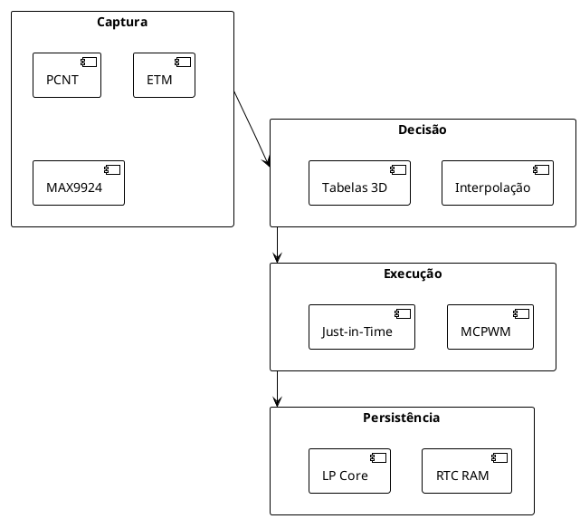
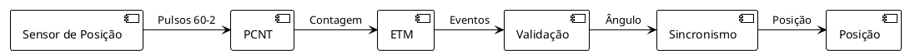
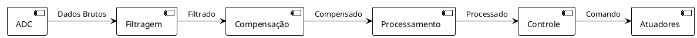
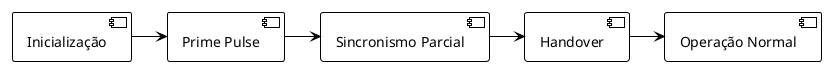
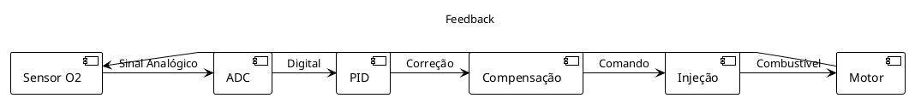

# Diagramas da ECU ESP32-P4

## Diagrama 1: Arquitetura Geral

```
+------------------------+     +------------------------+
|        Captura         |<--->|        Decisão         |
| (PCNT, ETM, MAX9924)   |     | (Interpolação, Tabelas)|
+------------------------+     +------------------------+
              |                           |
              v                           v
+------------------------+     +------------------------+
|        Execução        |     |        Persistência    |
| (MCPWM, Just-in-Time)  |     | (RTC RAM, LP Core)     |
+------------------------+     +------------------------+
```

### Referência PlantUML


## Diagrama 2: Fluxo de Sincronismo

```
Pulso Sensor → PCNT → ETM → Validação → Sincronismo
     |          |      |         |         |
     v          v      v         v         v
 60-2      Contagem  Eventos   Ângulo    Posição
```

### Referência PlantUML


## Diagrama 3: Tempo MCPWM

```
+---+   +---+   +---+   +---+   +---+
| I |   | I |   | I |   | I |   | I |  Injeção
+---+   +---+   +---+   +---+   +---+
    +---+   +---+   +---+   +---+   +---+
    | Ig|   | Ig|   | Ig|   | Ig|   | Ig|  Ignição
    +---+   +---+   +---+   +---+   +---+
```

### Referência PlantUML
```plantuml
@startuml
!theme plain

concise "Injeção" as I
concise "Ignição" as Ig

@0 as I@0
@0 as Ig@0

@0 <-> @50 : Dwell
@50 <-> @100 : Injeção
@100 <-> @150 : Dwell
@150 <-> @200 : Injeção

@25 <-> @75 : Avanço Ignição
@125 <-> @175 : Avanço Ignição

@enduml
```

## Diagrama 4: Fluxo de Dados

```
ADC → Filtragem → Compensação → Processamento → Controle
 |        |           |           |          |
 v        v           v           v          v
Sensor   Digital     Bateria    Tabelas    Atuadores
```

### Referência PlantUML


## Diagrama 5: Lógica de Partida

```
Inicialização → Prime Pulse → Sincronismo Parcial → Handover → Operação Normal
      |              |                 |              |              |
      v              v                 v              v              v
   LP Core       Injeção Única     Validação 360°   HP Core      Sincronismo 720°
```

### Referência PlantUML


## Diagrama 6: Malha Fechada de Lambda

```
Sensor O2 → ADC → PID → Compensação → Injeção → Motor → Sensor O2
     |        |     |      |          |        |        |
     v        v     v      v          v        v        v
    Analógico  Digital  Controle  Combustível  Combustão  Feedback
```

### Referência PlantUML


---

*Diagramas atualizados em: 31/01/2026*
*Versão: 1.0*