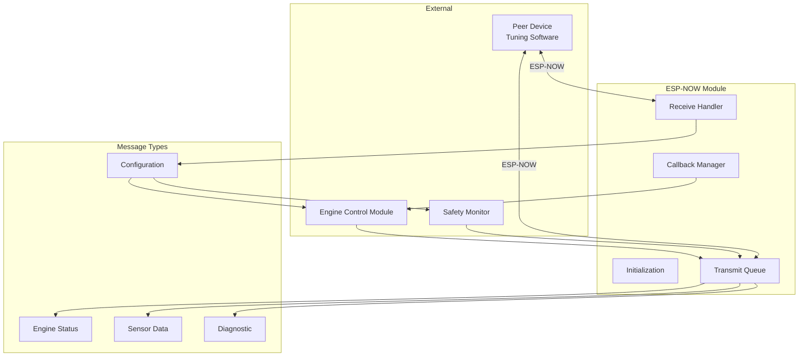
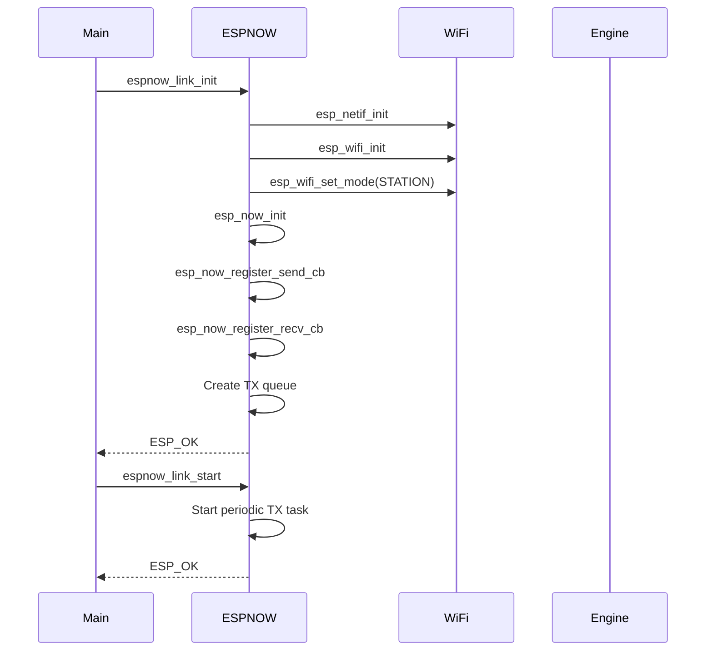
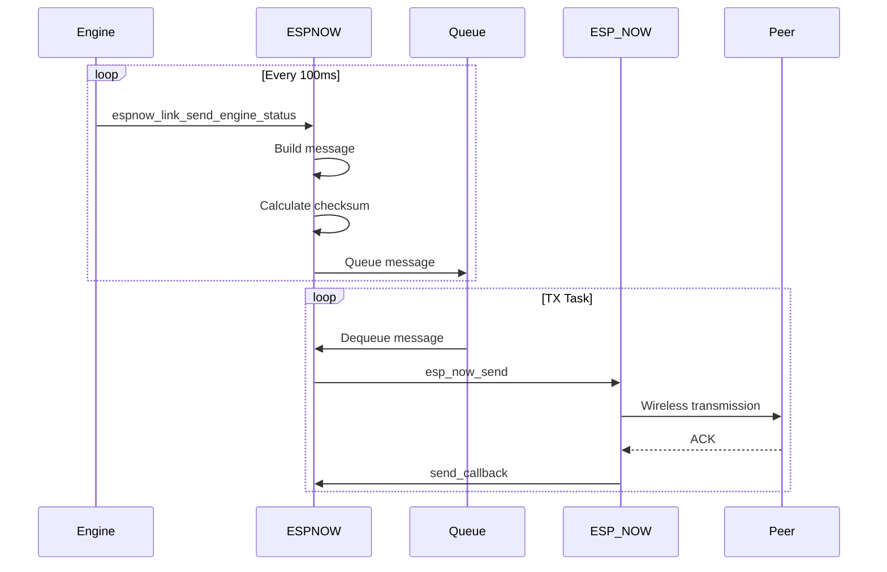
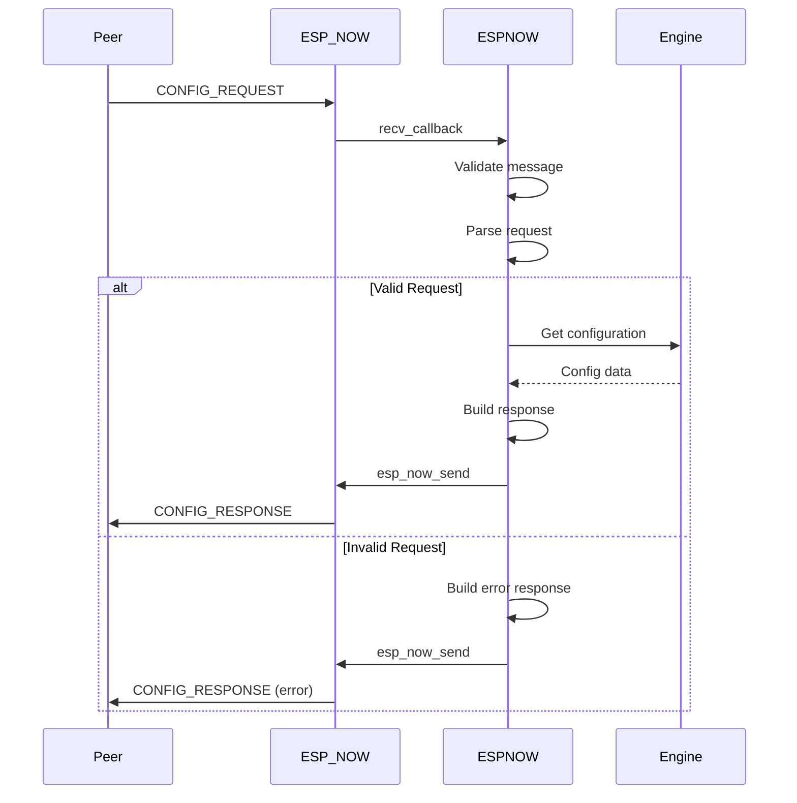

# ESP-NOW Communication Module - Technical Design

## 1. Overview

This document details the technical design for the ESP-NOW communication module for the ESP32-S3 EFI project. ESP-NOW provides a low-latency, connectionless wireless protocol ideal for real-time ECU supervision and tuning.

## 2. Requirements

### 2.1 Functional Requirements
- **FR1**: Transmit engine status at 10Hz minimum
- **FR2**: Transmit sensor data at 10Hz minimum
- **FR3**: Receive configuration updates asynchronously
- **FR4**: Support broadcast and unicast messaging
- **FR5**: Handle message acknowledgment and retry
- **FR6**: Coexist with WiFi when required

### 2.2 Non-Functional Requirements
- **NFR1**: Latency < 10ms for critical messages
- **NFR2**: Message loss rate < 1%
- **NFR3**: CPU overhead < 5%
- **NFR4**: Memory footprint < 4KB RAM

## 3. Architecture

### 3.1 Module Structure

```
firmware/s3/components/engine_control/
├── include/
│   └── espnow_link.h
└── src/
    └── espnow_link.c
```

### 3.2 Component Diagram



## 4. Data Structures

### 4.1 Message Header

```c
typedef struct __attribute__((packed)) {
    uint8_t     msg_type;       // Message type identifier
    uint8_t     msg_version;    // Protocol version
    uint16_t    msg_id;         // Sequence number
    uint16_t    payload_len;    // Payload length
    uint8_t     flags;          // Flags: ack_required, priority, etc.
    uint8_t     checksum;       // XOR checksum
} espnow_msg_header_t;

#define ESPNOW_MSG_HEADER_SIZE  8
#define ESPNOW_MAX_PAYLOAD      232  // ESP-NOW max is 250 bytes
#define ESPNOW_MAX_MSG_SIZE     (ESPNOW_MSG_HEADER_SIZE + ESPNOW_MAX_PAYLOAD)
```

### 4.2 Message Types

```c
typedef enum {
    ESPNOW_MSG_ENGINE_STATUS   = 0x01,  // ECU -> Peer
    ESPNOW_MSG_SENSOR_DATA     = 0x02,  // ECU -> Peer
    ESPNOW_MSG_DIAGNOSTIC      = 0x03,  // ECU -> Peer
    ESPNOW_MSG_CONFIG_REQUEST  = 0x10,  // Peer -> ECU
    ESPNOW_MSG_CONFIG_RESPONSE = 0x11,  // ECU -> Peer
    ESPNOW_MSG_TABLE_UPDATE    = 0x12,  // Peer -> ECU
    ESPNOW_MSG_PARAM_SET       = 0x13,  // Peer -> ECU
    ESPNOW_MSG_ACK             = 0xFF,  // Both directions
} espnow_msg_type_t;
```

### 4.3 Engine Status Message

```c
typedef struct __attribute__((packed)) {
    uint16_t    rpm;              // RPM (0-8000)
    uint16_t    map_kpa10;        // MAP * 10 (0-2500 = 0-250 kPa)
    int16_t     clt_c10;          // CLT * 10 (-400 to 1200 = -40 to 120°C)
    int16_t     iat_c10;          // IAT * 10
    uint16_t    tps_pct10;        // TPS * 10 (0-1000 = 0-100%)
    uint16_t    battery_mv;       // Battery voltage in mV
    uint8_t     sync_status;      // Sync state flags
    uint8_t     limp_mode;        // Limp mode active
    uint16_t    advance_deg10;    // Ignition advance * 10
    uint16_t    pw_us;            // Injection pulse width in us
    uint16_t    lambda_target;    // Lambda target * 1000
    uint16_t    lambda_measured;  // Lambda measured * 1000
    uint32_t    timestamp_ms;     // Message timestamp
} espnow_engine_status_t;
```

### 4.4 Sensor Data Message

```c
typedef struct __attribute__((packed)) {
    uint16_t    map_raw;          // MAP ADC raw
    uint16_t    tps_raw;          // TPS ADC raw
    uint16_t    clt_raw;          // CLT ADC raw
    uint16_t    iat_raw;          // IAT ADC raw
    uint16_t    o2_raw;           // O2 ADC raw
    uint16_t    vbat_raw;         // Battery ADC raw
    uint16_t    map_filtered;     // MAP filtered value
    uint16_t    tps_filtered;     // TPS filtered value
    uint8_t     sensor_faults;    // Sensor fault flags
    uint8_t     reserved;
    uint32_t    timestamp_ms;
} espnow_sensor_data_t;
```

### 4.5 Diagnostic Message

```c
typedef struct __attribute__((packed)) {
    uint8_t     error_count;      // Number of active errors
    uint8_t     warning_count;    // Number of warnings
    uint16_t    error_bitmap;     // Error flags
    uint16_t    warning_bitmap;   // Warning flags
    uint32_t    uptime_ms;        // System uptime
    uint16_t    cpu_usage_pct;    // CPU usage percentage
    uint16_t    free_heap;        // Free heap memory
    uint32_t    sync_lost_count;  // Sync loss counter
    uint32_t    tooth_count;      // Total tooth count
} espnow_diagnostic_t;

// Error bitmap flags
#define ESPNOW_ERR_OVER_REV       (1 << 0)
#define ESPNOW_ERR_OVERHEAT       (1 << 1)
#define ESPNOW_ERR_UNDERVOLT      (1 << 2)
#define ESPNOW_ERR_OVERVOLT       (1 << 3)
#define ESPNOW_ERR_SENSOR_MAP     (1 << 4)
#define ESPNOW_ERR_SENSOR_TPS     (1 << 5)
#define ESPNOW_ERR_SENSOR_CLT     (1 << 6)
#define ESPNOW_ERR_SENSOR_IAT     (1 << 7)
#define ESPNOW_ERR_SENSOR_O2      (1 << 8)
#define ESPNOW_ERR_SYNC_LOST      (1 << 9)
#define ESPNOW_ERR_LIMP_MODE      (1 << 10)
```

### 4.6 Configuration Messages

```c
// Configuration request
typedef struct __attribute__((packed)) {
    uint8_t     config_type;      // What to configure
    uint8_t     reserved;
    uint16_t    config_id;        // Configuration parameter ID
} espnow_config_request_t;

// Configuration response
typedef struct __attribute__((packed)) {
    uint8_t     config_type;
    uint8_t     status;           // 0 = success
    uint16_t    config_id;
    uint8_t     data[228];        // Configuration data
} espnow_config_response_t;

// Table update
typedef struct __attribute__((packed)) {
    uint8_t     table_id;         // Which table (VE, IGN, LAMBDA)
    uint8_t     chunk_index;      // Chunk number for large tables
    uint16_t    chunk_size;       // Size of this chunk
    uint8_t     data[228];        // Table data chunk
} espnow_table_update_t;

// Parameter set
typedef struct __attribute__((packed)) {
    uint16_t    param_id;         // Parameter identifier
    uint16_t    param_size;       // Parameter size
    uint8_t     param_value[228]; // Parameter value
} espnow_param_set_t;
```

### 4.7 Module State

```c
typedef struct {
    // State
    bool                    initialized;
    bool                    started;
    uint8_t                 peer_count;
    
    // Message tracking
    uint16_t                tx_msg_id;
    uint32_t                tx_count;
    uint32_t                rx_count;
    uint32_t                tx_errors;
    uint32_t                rx_errors;
    
    // Transmit buffer
    QueueHandle_t           tx_queue;
    uint8_t                 tx_buffer[ESPNOW_MAX_MSG_SIZE];
    
    // Peer management
    esp_now_peer_info_t     peers[ESPNOW_MAX_PEERS];
    uint8_t                 broadcast_mac[6];
    
    // Callbacks
    espnow_rx_callback_t    rx_callback;
    void                    *rx_callback_ctx;
    
    // Timing
    uint32_t                last_engine_status_ms;
    uint32_t                last_sensor_data_ms;
    uint32_t                last_diagnostic_ms;
    
    // Mutex for thread safety
    SemaphoreHandle_t       mutex;
} espnow_link_t;
```

## 5. API Design

### 5.1 Public API

```c
/**
 * @brief Initialize ESP-NOW link module
 * @return ESP_OK on success
 */
esp_err_t espnow_link_init(void);

/**
 * @brief Deinitialize ESP-NOW link module
 * @return ESP_OK on success
 */
esp_err_t espnow_link_deinit(void);

/**
 * @brief Start ESP-NOW communication
 * @return ESP_OK on success
 */
esp_err_t espnow_link_start(void);

/**
 * @brief Stop ESP-NOW communication
 * @return ESP_OK on success
 */
esp_err_t espnow_link_stop(void);

/**
 * @brief Add a peer device
 * @param peer_mac Peer MAC address
 * @param encrypt Enable encryption
 * @param lmk Local master key (if encrypted)
 * @return ESP_OK on success
 */
esp_err_t espnow_link_add_peer(const uint8_t *peer_mac, bool encrypt, const uint8_t *lmk);

/**
 * @brief Remove a peer device
 * @param peer_mac Peer MAC address
 * @return ESP_OK on success
 */
esp_err_t espnow_link_remove_peer(const uint8_t *peer_mac);

/**
 * @brief Register receive callback
 * @param callback Callback function
 * @param ctx User context
 * @return ESP_OK on success
 */
esp_err_t espnow_link_register_rx_callback(espnow_rx_callback_t callback, void *ctx);

/**
 * @brief Send engine status message
 * @param status Engine status data
 * @return ESP_OK on success
 */
esp_err_t espnow_link_send_engine_status(const espnow_engine_status_t *status);

/**
 * @brief Send sensor data message
 * @param data Sensor data
 * @return ESP_OK on success
 */
esp_err_t espnow_link_send_sensor_data(const espnow_sensor_data_t *data);

/**
 * @brief Send diagnostic message
 * @param diag Diagnostic data
 * @return ESP_OK on success
 */
esp_err_t espnow_link_send_diagnostic(const espnow_diagnostic_t *diag);

/**
 * @brief Get statistics
 * @param tx_count Transmit count
 * @param rx_count Receive count
 * @param tx_errors Transmit errors
 * @param rx_errors Receive errors
 */
void espnow_link_get_stats(uint32_t *tx_count, uint32_t *rx_count, 
                           uint32_t *tx_errors, uint32_t *rx_errors);
```

### 5.2 Callback Types

```c
/**
 * @brief Receive callback type
 * @param msg_type Message type
 * @param payload Payload data
 * @param payload_len Payload length
 * @param ctx User context
 */
typedef void (*espnow_rx_callback_t)(uint8_t msg_type, const uint8_t *payload, 
                                      uint16_t payload_len, void *ctx);
```

## 6. Sequence Diagrams

### 6.1 Initialization Sequence



### 6.2 Message Transmission



### 6.3 Configuration Update



## 7. Integration Points

### 7.1 Engine Control Integration

```c
// In engine_control.c
#include "espnow_link.h"

static void engine_status_publish(const engine_plan_cmd_t *cmd) {
    espnow_engine_status_t status = {
        .rpm = cmd->rpm,
        .map_kpa10 = cmd->load,
        .advance_deg10 = cmd->advance_deg10,
        .pw_us = cmd->pw_us,
        // ... other fields
    };
    espnow_link_send_engine_status(&status);
}
```

### 7.2 Safety Monitor Integration

```c
// In safety_monitor.c
#include "espnow_link.h"

void safety_report_error(safety_error_t error) {
    // ... existing error handling
    
    // Send diagnostic update
    espnow_diagnostic_t diag = {0};
    diag.error_bitmap |= (1 << error);
    espnow_link_send_diagnostic(&diag);
}
```

## 8. Error Handling

### 8.1 Error Codes

```c
typedef enum {
    ESPNOW_OK                   =  0,
    ESPNOW_ERR_NOT_INIT         = -1,
    ESPNOW_ERR_ALREADY_INIT     = -2,
    ESPNOW_ERR_NO_MEM           = -3,
    ESPNOW_ERR_INVALID_ARG      = -4,
    ESPNOW_ERR_TIMEOUT          = -5,
    ESPNOW_ERR_PEER_NOT_FOUND   = -6,
    ESPNOW_ERR_TX_FAILED        = -7,
    ESPNOW_ERR_CHECKSUM         = -8,
    ESPNOW_ERR_UNKNOWN_MSG      = -9,
} espnow_err_t;
```

### 8.2 Recovery Strategies

| Error | Recovery |
|-------|----------|
| TX Failed | Retry 3 times with backoff |
| Peer not found | Broadcast instead |
| Checksum error | Discard message |
| Queue full | Drop oldest message |
| WiFi conflict | Defer to WiFi, retry later |

## 9. Performance Considerations

### 9.1 CPU Optimization
- Use FreeRTOS queue for TX buffering
- Process RX in separate task
- Avoid malloc in data path
- Use packed structures

### 9.2 Memory Optimization
- Static TX buffer
- Reuse RX buffer
- Limit peer count to 4
- Queue depth of 10 messages

### 9.3 Latency Optimization
- Priority task for TX
- Direct callback for RX
- Minimize processing in ISR
- Use ESP-NOW's built-in ACK

## 10. Testing Strategy

### 10.1 Unit Tests
- Message serialization/deserialization
- Checksum calculation
- Queue operations
- Peer management

### 10.2 Integration Tests
- End-to-end message delivery
- Configuration update flow
- Error recovery
- Performance under load

### 10.3 Hardware Tests
- Range testing
- Interference testing
- Multi-peer scenarios
- Power consumption

## 11. Security Considerations

### 11.1 Encryption
- Optional AES-128 encryption via LMK
- Key exchange not implemented (pre-shared)
- Enable only for sensitive data

### 11.2 Message Validation
- Checksum verification
- Version checking
- Payload length validation
- Rate limiting

## 12. Configuration

### 12.1 Kconfig Options

```
config ESPNOW_LINK_ENABLED
    bool "Enable ESP-NOW Link"
    default y

config ESPNOW_TX_QUEUE_SIZE
    int "TX Queue Size"
    default 10

config ESPNOW_MAX_PEERS
    int "Maximum Peers"
    default 4

config ESPNOW_ENGINE_STATUS_INTERVAL_MS
    int "Engine Status Interval (ms)"
    default 100

config ESPNOW_SENSOR_DATA_INTERVAL_MS
    int "Sensor Data Interval (ms)"
    default 100

config ESPNOW_DIAG_INTERVAL_MS
    int "Diagnostic Interval (ms)"
    default 1000

config ESPNOW_ENABLE_ENCRYPTION
    bool "Enable ESP-NOW Encryption"
    default n
```

## 13. Future Enhancements

1. **Mesh Networking**: Support multi-hop communication
2. **OTA Updates**: Firmware updates via ESP-NOW
3. **Data Logging**: Store messages to SD card
4. **Remote Tuning**: Real-time parameter adjustment
5. **Multi-ECU**: Support multiple ECU coordination

---

**Document Version**: 1.0  
**Last Updated**: 2026-02-13  
**Author**: ESP32-EFI Team
