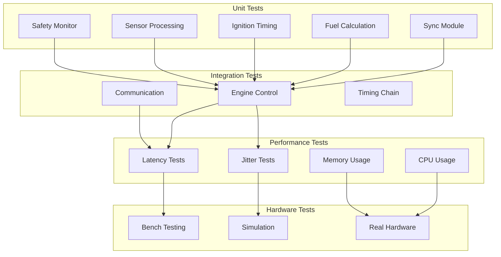

# Testing and Validation - Technical Design

## 1. Overview

This document details the testing strategy and validation procedures for the ESP32-S3 EFI project. It covers unit tests, integration tests, performance validation, and hardware testing.

## 2. Testing Architecture

### 2.1 Test Categories



### 2.2 Test Framework

```c
// Test framework structure
typedef struct {
    const char *name;
    const char *module;
    bool (*setup)(void);
    bool (*run)(void);
    void (*teardown)(void);
    uint32_t timeout_ms;
} test_case_t;

typedef struct {
    uint32_t total;
    uint32_t passed;
    uint32_t failed;
    uint32_t skipped;
    uint32_t duration_ms;
} test_results_t;
```

## 3. Unit Tests

### 3.1 Sync Module Tests

```c
// Test cases for sync module
static const test_case_t sync_tests[] = {
    {
        .name = "sync_init_deinit",
        .module = "sync",
        .run = test_sync_init_deinit,
    },
    {
        .name = "sync_gap_detection",
        .module = "sync",
        .setup = test_sync_setup,
        .run = test_sync_gap_detection,
        .teardown = test_sync_teardown,
    },
    {
        .name = "sync_rpm_calculation",
        .module = "sync",
        .setup = test_sync_setup,
        .run = test_sync_rpm_calculation,
        .teardown = test_sync_teardown,
    },
    {
        .name = "sync_phase_detection",
        .module = "sync",
        .setup = test_sync_setup,
        .run = test_sync_phase_detection,
        .teardown = test_sync_teardown,
    },
    {
        .name = "sync_overflow_handling",
        .module = "sync",
        .setup = test_sync_setup,
        .run = test_sync_overflow_handling,
        .teardown = test_sync_teardown,
    },
};

// Gap detection test
bool test_sync_gap_detection(void) {
    sync_data_t data;
    sync_config_t config = {
        .tooth_count = 58,
        .gap_tooth = 58,
    };
    
    // Simulate normal teeth
    for (int i = 0; i < 57; i++) {
        sync_update_from_capture(1000 + i * 100, false, false);
    }
    TEST_ASSERT(!g_sync_data.gap_detected);
    
    // Simulate gap (3x period)
    sync_update_from_capture(1000 + 57 * 100 + 300, false, false);
    TEST_ASSERT(g_sync_data.gap_detected);
    TEST_ASSERT(g_sync_data.tooth_index == 0);
    
    return true;
}

// RPM calculation test
bool test_sync_rpm_calculation(void) {
    // 6000 RPM = 10 rev/s = 100ms per rev
    // 60 teeth = 1.667ms per tooth
    uint32_t tooth_period_us = 1667;
    
    // Simulate teeth at 6000 RPM
    for (int i = 0; i < 60; i++) {
        sync_update_from_capture(i * tooth_period_us, false, false);
    }
    
    TEST_ASSERT(g_sync_data.rpm > 5950 && g_sync_data.rpm < 6050);
    return true;
}
```

### 3.2 Fuel Calculation Tests

```c
static const test_case_t fuel_tests[] = {
    {
        .name = "fuel_ve_interpolation",
        .module = "fuel",
        .run = test_fuel_ve_interpolation,
    },
    {
        .name = "fuel_pulsewidth_calculation",
        .module = "fuel",
        .run = test_fuel_pulsewidth_calculation,
    },
    {
        .name = "fuel_battery_compensation",
        .module = "fuel",
        .run = test_fuel_battery_compensation,
    },
    {
        .name = "fuel_lambda_correction",
        .module = "fuel",
        .run = test_fuel_lambda_correction,
    },
    {
        .name = "fuel_cache_hit_rate",
        .module = "fuel",
        .run = test_fuel_cache_hit_rate,
    },
};

// VE interpolation test
bool test_fuel_ve_interpolation(void) {
    // Create test table
    table_16x16_t ve_table;
    // ... initialize with known values
    
    // Test exact match
    uint16_t ve = table_16x16_interpolate(&ve_table, 3000, 60);
    TEST_ASSERT(ve == 72);  // Known value at 3000 RPM, 60% load
    
    // Test interpolation
    ve = table_16x16_interpolate(&ve_table, 3500, 65);
    TEST_ASSERT(ve > 70 && ve < 80);  // Should be interpolated
    
    return true;
}
```

### 3.3 Ignition Timing Tests

```c
static const test_case_t ignition_tests[] = {
    {
        .name = "ign_advance_calculation",
        .module = "ignition",
        .run = test_ign_advance_calculation,
    },
    {
        .name = "ign_dwell_calculation",
        .module = "ignition",
        .run = test_ign_dwell_calculation,
    },
    {
        .name = "ign_knock_retard",
        .module = "ignition",
        .run = test_ign_knock_retard,
    },
    {
        .name = "ign_timing_accuracy",
        .module = "ignition",
        .run = test_ign_timing_accuracy,
    },
};
```

### 3.4 Sensor Processing Tests

```c
static const test_case_t sensor_tests[] = {
    {
        .name = "sensor_filter_map",
        .module = "sensor",
        .run = test_sensor_filter_map,
    },
    {
        .name = "sensor_filter_tps",
        .module = "sensor",
        .run = test_sensor_filter_tps,
    },
    {
        .name = "sensor_calibration",
        .module = "sensor",
        .run = test_sensor_calibration,
    },
    {
        .name = "sensor_fault_detection",
        .module = "sensor",
        .run = test_sensor_fault_detection,
    },
};

// Sensor fault detection test
bool test_sensor_fault_detection(void) {
    sensor_data_t data;
    
    // Test out-of-range detection
    data.map_raw = 4095;  // Max ADC = short to VCC
    sensor_validate(&data);
    TEST_ASSERT(data.faults & SENSOR_FAULT_MAP_SHORT_VCC);
    
    data.map_raw = 0;  // Min ADC = short to GND
    sensor_validate(&data);
    TEST_ASSERT(data.faults & SENSOR_FAULT_MAP_SHORT_GND);
    
    return true;
}
```

### 3.5 Safety Monitor Tests

```c
static const test_case_t safety_tests[] = {
    {
        .name = "safety_over_rev",
        .module = "safety",
        .run = test_safety_over_rev,
    },
    {
        .name = "safety_overheat",
        .module = "safety",
        .run = test_safety_overheat,
    },
    {
        .name = "safety_voltage",
        .module = "safety",
        .run = test_safety_voltage,
    },
    {
        .name = "safety_limp_mode",
        .module = "safety",
        .run = test_safety_limp_mode,
    },
    {
        .name = "safety_watchdog",
        .module = "safety",
        .run = test_safety_watchdog,
    },
};

// Over-rev protection test
bool test_safety_over_rev(void) {
    safety_config_t config = {
        .rpm_limit = 8000,
        .rpm_hysteresis = 200,
    };
    safety_set_config(&config);
    
    // Normal RPM
    TEST_ASSERT(!safety_check_over_rev(7500));
    
    // At limit
    TEST_ASSERT(!safety_check_over_rev(8000));
    
    // Over limit
    TEST_ASSERT(safety_check_over_rev(8100));
    
    // Fuel cutoff
    TEST_ASSERT(safety_check_over_rev(8500));
    
    return true;
}
```

## 4. Integration Tests

### 4.1 Engine Control Integration

```c
static const test_case_t engine_integration_tests[] = {
    {
        .name = "engine_full_cycle",
        .module = "integration",
        .setup = test_engine_setup,
        .run = test_engine_full_cycle,
        .teardown = test_engine_teardown,
        .timeout_ms = 5000,
    },
    {
        .name = "engine_sync_to_actuation",
        .module = "integration",
        .run = test_engine_sync_to_actuation,
    },
    {
        .name = "engine_closed_loop",
        .module = "integration",
        .run = test_engine_closed_loop,
    },
};

// Full engine cycle test
bool test_engine_full_cycle(void) {
    // Initialize all modules
    TEST_ASSERT(engine_control_init() == ESP_OK);
    TEST_ASSERT(sync_init() == ESP_OK);
    TEST_ASSERT(sensor_init() == ESP_OK);
    
    // Start engine control
    TEST_ASSERT(engine_control_start() == ESP_OK);
    
    // Simulate engine running
    for (int cycle = 0; cycle < 100; cycle++) {
        // Simulate CKP/CMP pulses
        simulate_crank_pulse(cycle);
        
        // Wait for processing
        vTaskDelay(pdMS_TO_TICKS(1));
        
        // Verify outputs
        verify_injection_output();
        verify_ignition_output();
    }
    
    // Cleanup
    engine_control_stop();
    return true;
}
```

### 4.2 Communication Integration

```c
static const test_case_t comm_integration_tests[] = {
    {
        .name = "comm_espnow_roundtrip",
        .module = "integration",
        .run = test_comm_espnow_roundtrip,
    },
    {
        .name = "comm_cli_commands",
        .module = "integration",
        .run = test_comm_cli_commands,
    },
    {
        .name = "comm_tuning_protocol",
        .module = "integration",
        .run = test_comm_tuning_protocol,
    },
};
```

## 5. Performance Tests

### 5.1 Latency Tests

```c
typedef struct {
    const char *name;
    uint32_t target_us;
    uint32_t (*measure)(void);
} latency_test_t;

static const latency_test_t latency_tests[] = {
    {
        .name = "sync_response",
        .target_us = 100,
        .measure = measure_sync_response,
    },
    {
        .name = "injection_timing",
        .target_us = 50,
        .measure = measure_injection_timing,
    },
    {
        .name = "ignition_timing",
        .target_us = 20,
        .measure = measure_ignition_timing,
    },
    {
        .name = "closed_loop_update",
        .target_us = 1000,
        .measure = measure_closed_loop_update,
    },
};

// Sync response latency measurement
uint32_t measure_sync_response(void) {
    uint32_t start = hp_get_cycle_count();
    
    // Simulate tooth event
    simulate_crank_pulse(0);
    
    // Wait for sync update
    while (!sync_data_updated()) {
        // Busy wait
    }
    
    uint32_t end = hp_get_cycle_count();
    return hp_cycles_to_us_u32(end - start);
}

// Run latency tests
void run_latency_tests(void) {
    for (int i = 0; i < ARRAY_SIZE(latency_tests); i++) {
        uint32_t measurements[100];
        uint32_t min, max, avg;
        
        // Take 100 measurements
        for (int j = 0; j < 100; j++) {
            measurements[j] = latency_tests[i].measure();
        }
        
        // Calculate statistics
        calculate_stats(measurements, 100, &min, &max, &avg);
        
        // Report
        printf("%s: min=%lu, max=%lu, avg=%lu us (target: %lu us)\n",
               latency_tests[i].name, min, max, avg, latency_tests[i].target_us);
        
        // Verify target
        TEST_ASSERT(avg <= latency_tests[i].target_us);
    }
}
```

### 5.2 Jitter Tests

```c
typedef struct {
    const char *name;
    uint32_t max_jitter_us;
    void (*trigger)(void);
    uint32_t (*measure)(void);
} jitter_test_t;

static const jitter_test_t jitter_tests[] = {
    {
        .name = "injection_jitter",
        .max_jitter_us = 10,
        .trigger = trigger_injection,
        .measure = measure_injection_jitter,
    },
    {
        .name = "ignition_jitter",
        .max_jitter_us = 5,
        .trigger = trigger_ignition,
        .measure = measure_ignition_jitter,
    },
};

// Run jitter tests
void run_jitter_tests(void) {
    for (int i = 0; i < ARRAY_SIZE(jitter_tests); i++) {
        uint32_t jitter_samples[1000];
        
        // Collect jitter samples
        for (int j = 0; j < 1000; j++) {
            jitter_tests[i].trigger();
            jitter_samples[j] = jitter_tests[i].measure();
        }
        
        // Calculate max jitter
        uint32_t max_jitter = find_max(jitter_samples, 1000);
        
        printf("%s: max_jitter=%lu us (limit: %lu us)\n",
               jitter_tests[i].name, max_jitter, jitter_tests[i].max_jitter_us);
        
        TEST_ASSERT(max_jitter <= jitter_tests[i].max_jitter_us);
    }
}
```

### 5.3 CPU Usage Tests

```c
void test_cpu_usage(void) {
    uint32_t idle_count_start = get_idle_count();
    uint32_t total_count_start = get_total_count();
    
    // Run for 10 seconds
    vTaskDelay(pdMS_TO_TICKS(10000));
    
    uint32_t idle_count_end = get_idle_count();
    uint32_t total_count_end = get_total_count();
    
    uint32_t cpu_usage = 100 - ((idle_count_end - idle_count_start) * 100 / 
                                 (total_count_end - total_count_start));
    
    printf("CPU Usage: %lu%%\n", cpu_usage);
    TEST_ASSERT(cpu_usage < 80);  // Should be under 80%
}
```

### 5.4 Memory Usage Tests

```c
void test_memory_usage(void) {
    uint32_t free_heap = esp_get_free_heap_size();
    uint32_t min_free = esp_get_minimum_free_heap_size();
    uint32_t largest_block = heap_caps_get_largest_free_block(MALLOC_CAP_8BIT);
    
    printf("Free Heap: %lu bytes\n", free_heap);
    printf("Min Free: %lu bytes\n", min_free);
    printf("Largest Block: %lu bytes\n", largest_block);
    
    // Verify minimum requirements
    TEST_ASSERT(free_heap > 32768);      // At least 32KB free
    TEST_ASSERT(largest_block > 16384);  // At least 16KB contiguous
}
```

## 6. Hardware Tests

### 6.1 Bench Test Setup

```c
// Bench test configuration
typedef struct {
    // Signal generators
    signal_gen_t ckp_gen;      // Crank signal generator
    signal_gen_t cmp_gen;      // Cam signal generator
    
    // Load simulators
    load_sim_t injector_load;  // Injector load simulation
    load_sim_t coil_load;      // Coil load simulation
    
    // Measurement
    scope_t timing_scope;      // Oscilloscope for timing
    dmm_t voltage_dmm;         // Multimeter for voltage
} bench_setup_t;

void bench_test_init(bench_setup_t *setup) {
    // Configure CKP generator (60-2 pattern)
    setup->ckp_gen.pattern = PATTERN_60_2;
    setup->ckp_gen.amplitude = 5.0f;
    setup->ckp_gen.frequency = 100;  // Start at 100 Hz
    
    // Configure CMP generator
    setup->cmp_gen.pattern = PATTERN_1_PER_REV;
    setup->cmp_gen.phase = 0;
    
    // Configure load simulators
    setup->injector_load.resistance = 12.0f;  // 12 ohms
    setup->coil_load.resistance = 1.0f;       // 1 ohm
}
```

### 6.2 Timing Accuracy Test

```c
void test_timing_accuracy(void) {
    bench_setup_t bench;
    bench_test_init(&bench);
    
    // Test at various RPMs
    uint16_t test_rpms[] = {500, 1000, 2000, 4000, 6000, 8000};
    
    for (int i = 0; i < ARRAY_SIZE(test_rpms); i++) {
        // Set RPM
        set_crank_rpm(&bench.ckp_gen, test_rpms[i]);
        
        // Wait for sync
        wait_for_sync();
        
        // Measure ignition timing
        float measured_advance = measure_ignition_advance(&bench.timing_scope);
        float expected_advance = get_expected_advance(test_rpms[i]);
        
        float error = fabsf(measured_advance - expected_advance);
        
        printf("RPM=%d: Expected=%.1f°, Measured=%.1f°, Error=%.2f°\n",
               test_rpms[i], expected_advance, measured_advance, error);
        
        TEST_ASSERT(error <= 0.5f);  // Within ±0.5°
    }
}
```

### 6.3 Injection Duration Test

```c
void test_injection_duration(void) {
    bench_setup_t bench;
    bench_test_init(&bench);
    
    // Test at various pulse widths
    uint16_t test_pw[] = {500, 1000, 2000, 5000, 10000, 15000};
    
    for (int i = 0; i < ARRAY_SIZE(test_pw); i++) {
        // Set pulse width
        set_target_pulsewidth(test_pw[i]);
        
        // Trigger injection
        trigger_injection();
        
        // Measure actual pulse width
        uint32_t measured_pw = measure_pulsewidth(&bench.timing_scope);
        
        int32_t error = (int32_t)measured_pw - (int32_t)test_pw[i];
        
        printf("PW=%d us: Measured=%lu us, Error=%ld us\n",
               test_pw[i], measured_pw, error);
        
        TEST_ASSERT(abs(error) <= 50);  // Within ±50 us
    }
}
```

## 7. Test Runner

### 7.1 Test Execution

```c
typedef struct {
    const char *category;
    const test_case_t *tests;
    uint32_t count;
} test_suite_t;

static const test_suite_t test_suites[] = {
    { "unit_sync", sync_tests, ARRAY_SIZE(sync_tests) },
    { "unit_fuel", fuel_tests, ARRAY_SIZE(fuel_tests) },
    { "unit_ignition", ignition_tests, ARRAY_SIZE(ignition_tests) },
    { "unit_sensor", sensor_tests, ARRAY_SIZE(sensor_tests) },
    { "unit_safety", safety_tests, ARRAY_SIZE(safety_tests) },
    { "integration", engine_integration_tests, ARRAY_SIZE(engine_integration_tests) },
    { "performance", NULL, 0 },  // Special handling
};

void run_all_tests(void) {
    test_results_t total = {0};
    
    for (int s = 0; s < ARRAY_SIZE(test_suites); s++) {
        printf("\n=== Running %s tests ===\n", test_suites[s].category);
        
        test_results_t suite_results = {0};
        
        for (int t = 0; t < test_suites[s].count; t++) {
            const test_case_t *test = &test_suites[s].tests[t];
            
            printf("Running %s... ", test->name);
            
            // Setup
            if (test->setup) test->setup();
            
            // Run
            uint32_t start = esp_timer_get_time();
            bool passed = test->run();
            uint32_t duration = esp_timer_get_time() - start;
            
            // Teardown
            if (test->teardown) test->teardown();
            
            // Record result
            if (passed) {
                printf("PASSED (%lu us)\n", duration);
                suite_results.passed++;
            } else {
                printf("FAILED\n");
                suite_results.failed++;
            }
            suite_results.total++;
            suite_results.duration_ms += duration / 1000;
        }
        
        // Print suite summary
        printf("\n%s: %u/%u passed (%lu ms)\n",
               test_suites[s].category,
               suite_results.passed,
               suite_results.total,
               suite_results.duration_ms);
        
        total.total += suite_results.total;
        total.passed += suite_results.passed;
        total.failed += suite_results.failed;
    }
    
    // Print total summary
    printf("\n=== TOTAL: %u/%u passed ===\n", total.passed, total.total);
}
```

## 8. Test Configuration

### 8.1 Kconfig Options

```
config TESTING_ENABLED
    bool "Enable testing framework"
    default n

config TESTING_VERBOSE
    bool "Verbose test output"
    default y

config TESTING_BENCH
    bool "Enable bench testing"
    default n

config TESTING_HARDWARE
    bool "Enable hardware testing"
    default n

config TESTING_REPORT_SD
    bool "Save test report to SD card"
    default n
```

## 9. Test Report Format

### 9.1 JSON Report

```json
{
    "test_run": {
        "timestamp": "2026-02-13T14:40:00Z",
        "ecu_version": "1.0.0",
        "test_framework_version": "1.0.0"
    },
    "results": {
        "total": 50,
        "passed": 48,
        "failed": 2,
        "skipped": 0,
        "duration_ms": 5432
    },
    "suites": [
        {
            "name": "unit_sync",
            "total": 5,
            "passed": 5,
            "failed": 0,
            "tests": [
                {
                    "name": "sync_init_deinit",
                    "status": "passed",
                    "duration_us": 123
                }
            ]
        }
    ]
}
```

---

**Document Version**: 1.0  
**Last Updated**: 2026-02-13  
**Author**: ESP32-EFI Team
