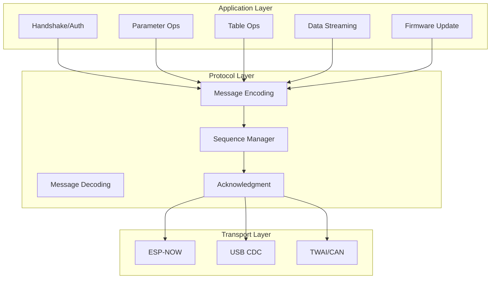
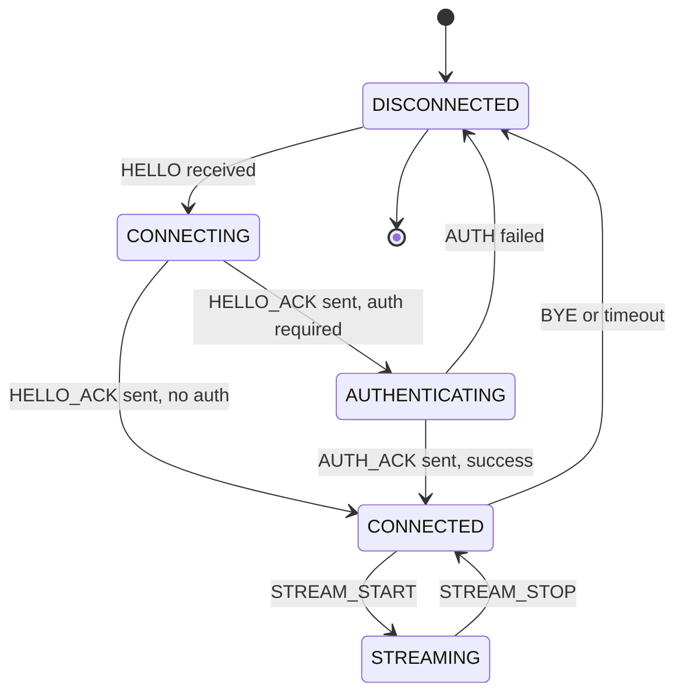
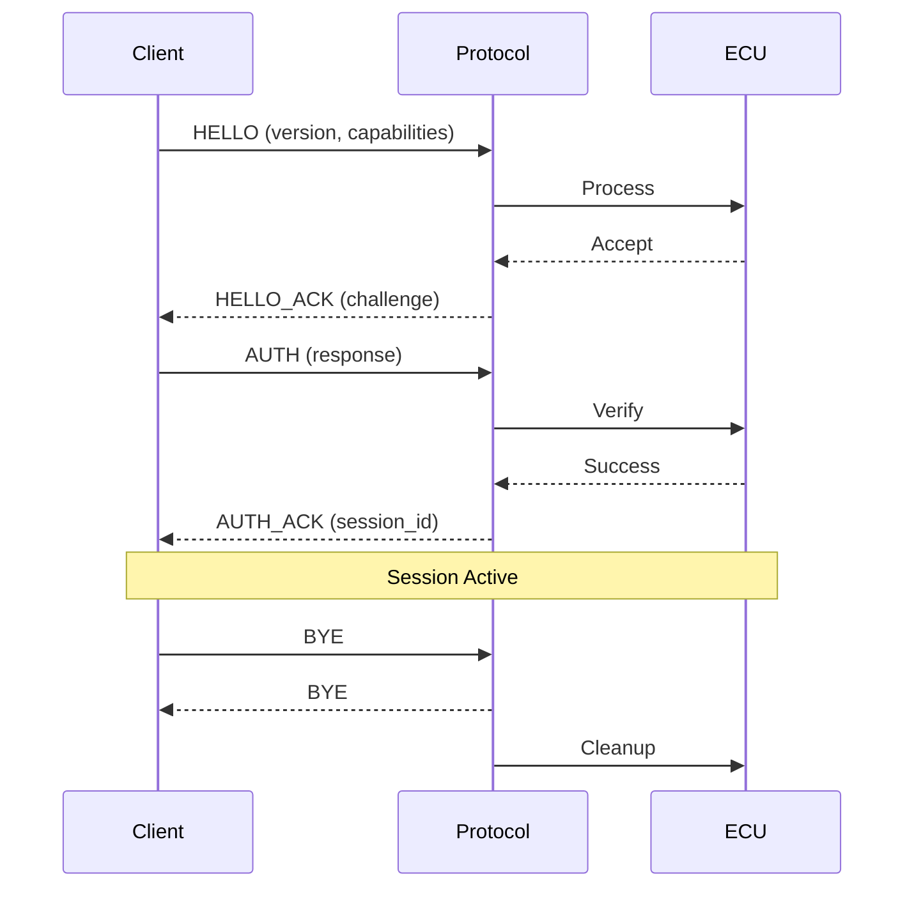
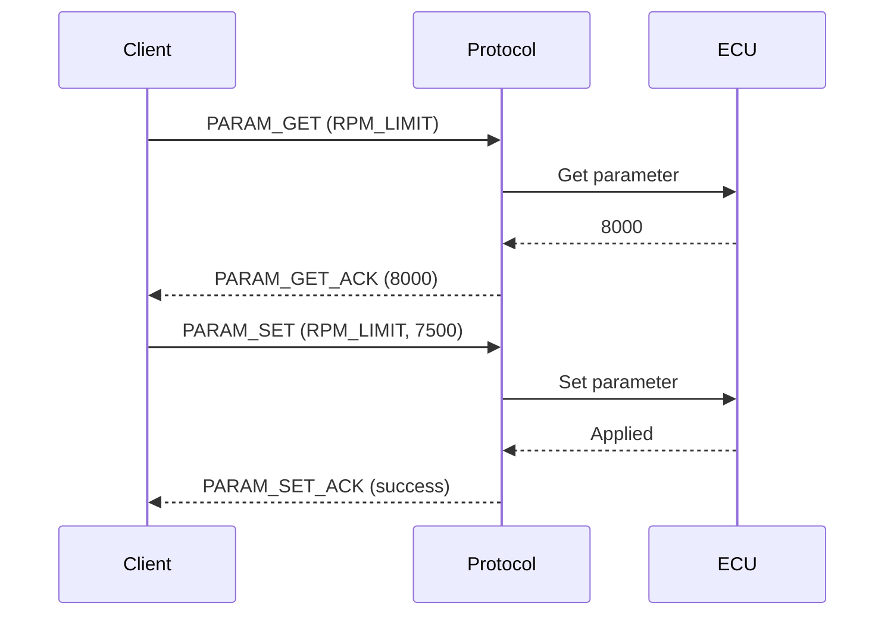
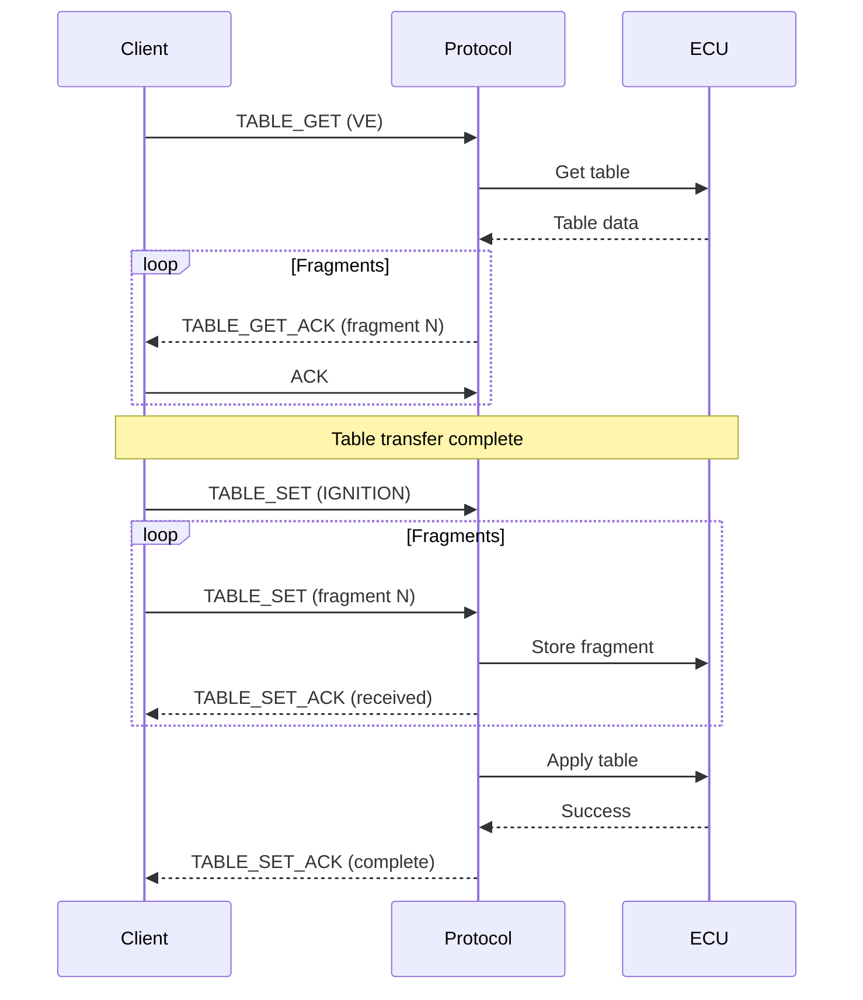

# Remote Tuning Protocol - Technical Design

## 1. Overview

This document details the technical design for the Remote Tuning Protocol module for the ESP32-S3 EFI project. This protocol enables professional tuning software to communicate with the ECU for real-time adjustments and data streaming.

## 2. Requirements

### 2.1 Functional Requirements
- **FR1**: Real-time parameter adjustment
- **FR2**: Table upload/download with verification
- **FR3**: Live data streaming at configurable rates
- **FR4**: Session management with authentication
- **FR5**: Firmware update capability
- **FR6**: Multi-client support (optional)

### 2.2 Non-Functional Requirements
- **NFR1**: Parameter update latency < 50ms
- **NFR2**: Table transfer time < 5 seconds for full set
- **NFR3**: Streaming rate up to 100Hz
- **NFR4**: Protocol overhead < 5% of bandwidth

## 3. Architecture

### 3.1 Module Structure

```
firmware/s3/components/engine_control/
├── include/
│   └── tuning_protocol.h
└── src/
    └── tuning_protocol.c
```

### 3.2 Protocol Stack



## 4. Protocol Specification

### 4.1 Message Format

```c
typedef struct __attribute__((packed)) {
    uint8_t     start_byte;      // 0xAA - Start of message
    uint8_t     msg_type;        // Message type
    uint16_t    msg_id;          // Sequence number
    uint16_t    payload_len;     // Payload length
    uint8_t     flags;           // Flags
    uint8_t     checksum;        // Header checksum
    uint8_t     payload[];       // Variable payload
    uint8_t     end_byte;        // 0x55 - End of message
} tuning_msg_t;

#define TUNING_MSG_START    0xAA
#define TUNING_MSG_END      0x55
#define TUNING_MAX_PAYLOAD  240
```

### 4.2 Message Types

```c
typedef enum {
    // Handshake
    TUNING_MSG_HELLO          = 0x01,  // Client -> ECU
    TUNING_MSG_HELLO_ACK      = 0x02,  // ECU -> Client
    TUNING_MSG_AUTH           = 0x03,  // Client -> ECU
    TUNING_MSG_AUTH_ACK       = 0x04,  // ECU -> Client
    TUNING_MSG_BYE            = 0x05,  // Both
    
    // Parameters
    TUNING_MSG_PARAM_GET      = 0x10,  // Client -> ECU
    TUNING_MSG_PARAM_GET_ACK  = 0x11,  // ECU -> Client
    TUNING_MSG_PARAM_SET      = 0x12,  // Client -> ECU
    TUNING_MSG_PARAM_SET_ACK  = 0x13,  // ECU -> Client
    TUNING_MSG_PARAM_LIST     = 0x14,  // Client -> ECU
    TUNING_MSG_PARAM_LIST_ACK = 0x15,  // ECU -> Client
    
    // Tables
    TUNING_MSG_TABLE_GET      = 0x20,  // Client -> ECU
    TUNING_MSG_TABLE_GET_ACK  = 0x21,  // ECU -> Client
    TUNING_MSG_TABLE_SET      = 0x22,  // Client -> ECU
    TUNING_MSG_TABLE_SET_ACK  = 0x23,  // ECU -> Client
    TUNING_MSG_TABLE_LIST     = 0x24,  // Client -> ECU
    TUNING_MSG_TABLE_LIST_ACK = 0x25,  // ECU -> Client
    
    // Streaming
    TUNING_MSG_STREAM_START   = 0x30,  // Client -> ECU
    TUNING_MSG_STREAM_DATA    = 0x31,  // ECU -> Client
    TUNING_MSG_STREAM_STOP    = 0x32,  // Client -> ECU
    
    // Firmware
    TUNING_MSG_FW_INFO        = 0x40,  // Client -> ECU
    TUNING_MSG_FW_INFO_ACK    = 0x41,  // ECU -> Client
    TUNING_MSG_FW_DATA        = 0x42,  // Client -> ECU
    TUNING_MSG_FW_DATA_ACK    = 0x43,  // ECU -> Client
    TUNING_MSG_FW_APPLY       = 0x44,  // Client -> ECU
    
    // Error
    TUNING_MSG_ERROR          = 0xFF,  // ECU -> Client
} tuning_msg_type_t;
```

### 4.3 Flags

```c
#define TUNING_FLAG_ACK_REQUIRED  (1 << 0)  // Requires acknowledgment
#define TUNING_FLAG_COMPRESSED    (1 << 1)  // Payload is compressed
#define TUNING_FLAG_ENCRYPTED     (1 << 2)  // Payload is encrypted
#define TUNING_FLAG_FRAGMENT      (1 << 3)  // Fragmented message
#define TUNING_FLAG_LAST_FRAGMENT (1 << 4)  // Last fragment
#define TUNING_FLAG_PRIORITY      (1 << 5)  // High priority message
```

## 5. Message Definitions

### 5.1 Handshake Messages

```c
// HELLO - Client initiates connection
typedef struct __attribute__((packed)) {
    uint8_t     protocol_version;
    uint8_t     client_version;
    uint16_t    capabilities;      // Feature flags
    char        client_name[32];
} tuning_hello_t;

// HELLO_ACK - ECU responds
typedef struct __attribute__((packed)) {
    uint8_t     protocol_version;
    uint8_t     ecu_version;
    uint16_t    capabilities;
    uint8_t     auth_required;
    char        ecu_name[32];
    uint8_t     challenge[16];     // For auth if required
} tuning_hello_ack_t;

// AUTH - Client authenticates
typedef struct __attribute__((packed)) {
    uint8_t     auth_type;         // 0=none, 1=password, 2=token
    uint8_t     response[32];      // Auth response
} tuning_auth_t;

// AUTH_ACK - ECU confirms auth
typedef struct __attribute__((packed)) {
    uint8_t     status;            // 0=success
    uint8_t     session_id[8];     // Session identifier
    uint16_t    permissions;       // Granted permissions
} tuning_auth_ack_t;
```

### 5.2 Parameter Messages

```c
// Parameter identifier enum
typedef enum {
    PARAM_RPM_LIMIT          = 0x0001,
    PARAM_FUEL_CUTOFF        = 0x0002,
    PARAM_TEMP_LIMIT         = 0x0003,
    PARAM_BATTERY_MIN        = 0x0004,
    PARAM_BATTERY_MAX        = 0x0005,
    PARAM_EOI_BOUNDARY       = 0x0010,
    PARAM_EOI_NORMAL         = 0x0011,
    PARAM_STFT_LIMIT         = 0x0012,
    PARAM_LTFT_LIMIT         = 0x0013,
    PARAM_CLOSED_LOOP_EN     = 0x0014,
    PARAM_STEPPER_IDLE_POS   = 0x0020,
    PARAM_FAN_TEMP_ON        = 0x0021,
    PARAM_FAN_TEMP_OFF       = 0x0022,
    // ... more parameters
} tuning_param_id_t;

// PARAM_GET - Request parameter value
typedef struct __attribute__((packed)) {
    uint16_t    param_id;
    uint16_t    reserved;
} tuning_param_get_t;

// PARAM_GET_ACK - Parameter value response
typedef struct __attribute__((packed)) {
    uint16_t    param_id;
    uint8_t     param_type;        // 0=u8, 1=u16, 2=u32, 3=float
    uint8_t     param_size;
    uint8_t     value[16];         // Max 16 bytes
} tuning_param_get_ack_t;

// PARAM_SET - Set parameter value
typedef struct __attribute__((packed)) {
    uint16_t    param_id;
    uint8_t     param_type;
    uint8_t     param_size;
    uint8_t     value[16];
} tuning_param_set_t;

// PARAM_SET_ACK - Confirm parameter set
typedef struct __attribute__((packed)) {
    uint16_t    param_id;
    uint8_t     status;            // 0=success
    uint8_t     applied;           // 0=pending, 1=applied
} tuning_param_set_ack_t;
```

### 5.3 Table Messages

```c
// Table identifier enum
typedef enum {
    TABLE_VE          = 0x01,
    TABLE_IGNITION    = 0x02,
    TABLE_LAMBDA      = 0x03,
    TABLE_AFR         = 0x04,
    TABLE_INJ_DEAD    = 0x05,
    TABLE_IGN_DWELL   = 0x06,
} tuning_table_id_t;

// TABLE_GET - Request table
typedef struct __attribute__((packed)) {
    uint8_t     table_id;
    uint8_t     flags;             // 0=full, 1=delta
    uint16_t    reserved;
} tuning_table_get_t;

// TABLE_GET_ACK - Table data (may be fragmented)
typedef struct __attribute__((packed)) {
    uint8_t     table_id;
    uint8_t     rows;
    uint8_t     cols;
    uint8_t     fragment_index;
    uint16_t    fragment_total;
    uint16_t    data_len;
    uint8_t     data[];            // Table data
} tuning_table_get_ack_t;

// TABLE_SET - Upload table (may be fragmented)
typedef struct __attribute__((packed)) {
    uint8_t     table_id;
    uint8_t     rows;
    uint8_t     cols;
    uint8_t     fragment_index;
    uint16_t    fragment_total;
    uint16_t    data_len;
    uint8_t     data[];
} tuning_table_set_t;

// TABLE_SET_ACK - Confirm table upload
typedef struct __attribute__((packed)) {
    uint8_t     table_id;
    uint8_t     status;
    uint16_t    crc32;             // CRC of received data
    uint8_t     fragments_received;
} tuning_table_set_ack_t;
```

### 5.4 Streaming Messages

```c
// STREAM_START - Start data streaming
typedef struct __attribute__((packed)) {
    uint16_t    interval_ms;       // Streaming interval
    uint16_t    data_mask;         // What data to stream
    uint8_t     format;            // 0=binary, 1=json
    uint8_t     reserved;
} tuning_stream_start_t;

// Data mask flags
#define STREAM_DATA_RPM          (1 << 0)
#define STREAM_DATA_MAP          (1 << 1)
#define STREAM_DATA_TPS          (1 << 2)
#define STREAM_DATA_CLT          (1 << 3)
#define STREAM_DATA_IAT          (1 << 4)
#define STREAM_DATA_O2           (1 << 5)
#define STREAM_DATA_ADVANCE      (1 << 6)
#define STREAM_DATA_PW           (1 << 7)
#define STREAM_DATA_LAMBDA       (1 << 8)
#define STREAM_DATA_ERRORS       (1 << 9)
#define STREAM_DATA_ALL          0xFFFF

// STREAM_DATA - Streaming data
typedef struct __attribute__((packed)) {
    uint32_t    timestamp_ms;
    uint16_t    data_mask;
    uint16_t    data_len;
    uint8_t     data[];            // Variable based on mask
} tuning_stream_data_t;
```

### 5.5 Firmware Messages

```c
// FW_INFO - Request firmware info
typedef struct __attribute__((packed)) {
    uint8_t     reserved[4];
} tuning_fw_info_t;

// FW_INFO_ACK - Firmware info response
typedef struct __attribute__((packed)) {
    char        version[16];
    char        build_date[16];
    uint32_t    flash_size;
    uint32_t    app_size;
    uint8_t     partition_current;
    uint8_t     partition_count;
    uint8_t     ota_supported;
    uint8_t     reserved;
} tuning_fw_info_ack_t;

// FW_DATA - Firmware chunk
typedef struct __attribute__((packed)) {
    uint32_t    offset;
    uint16_t    chunk_size;
    uint16_t    total_size;
    uint8_t     data[];
} tuning_fw_data_t;

// FW_DATA_ACK - Confirm chunk
typedef struct __attribute__((packed)) {
    uint32_t    offset;
    uint8_t     status;
    uint8_t     progress_pct;
} tuning_fw_data_ack_t;
```

### 5.6 Error Message

```c
typedef struct __attribute__((packed)) {
    uint8_t     error_code;
    uint8_t     severity;          // 0=info, 1=warning, 2=error, 3=fatal
    uint16_t    related_msg_id;
    char        message[64];
} tuning_error_t;

typedef enum {
    TUNING_ERR_NONE           = 0,
    TUNING_ERR_UNKNOWN_MSG    = 1,
    TUNING_ERR_INVALID_PARAM  = 2,
    TUNING_ERR_AUTH_FAILED    = 3,
    TUNING_ERR_PERMISSION     = 4,
    TUNING_ERR_BUSY           = 5,
    TUNING_ERR_TIMEOUT        = 6,
    TUNING_ERR_CRC            = 7,
    TUNING_ERR_FLASH          = 8,
    TUNING_ERR_NOT_SUPPORTED  = 9,
} tuning_error_code_t;
```

## 6. State Machine

### 6.1 Connection States



### 6.2 Session State

```c
typedef enum {
    TUNING_STATE_DISCONNECTED,
    TUNING_STATE_CONNECTING,
    TUNING_STATE_AUTHENTICATING,
    TUNING_STATE_CONNECTED,
    TUNING_STATE_STREAMING,
    TUNING_STATE_UPDATING,
} tuning_state_t;

typedef struct {
    tuning_state_t  state;
    uint8_t         session_id[8];
    uint16_t        permissions;
    uint32_t        last_activity;
    uint16_t        tx_seq;
    uint16_t        rx_seq;
    uint8_t         transport;      // ESP-NOW, USB, CAN
} tuning_session_t;
```

## 7. API Design

### 7.1 Public API

```c
/**
 * @brief Initialize tuning protocol
 * @return ESP_OK on success
 */
esp_err_t tuning_protocol_init(void);

/**
 * @brief Deinitialize tuning protocol
 * @return ESP_OK on success
 */
esp_err_t tuning_protocol_deinit(void);

/**
 * @brief Start tuning server
 * @param transport Transport type (ESP-NOW, USB, CAN)
 * @return ESP_OK on success
 */
esp_err_t tuning_protocol_start(uint8_t transport);

/**
 * @brief Stop tuning server
 * @return ESP_OK on success
 */
esp_err_t tuning_protocol_stop(void);

/**
 * @brief Register parameter callback
 * @param param_id Parameter ID
 * @param callback Callback for get/set
 * @param ctx User context
 * @return ESP_OK on success
 */
esp_err_t tuning_register_param_callback(uint16_t param_id,
                                          tuning_param_callback_t callback,
                                          void *ctx);

/**
 * @brief Register table callback
 * @param table_id Table ID
 * @param callback Callback for get/set
 * @param ctx User context
 * @return ESP_OK on success
 */
esp_err_t tuning_register_table_callback(uint8_t table_id,
                                          tuning_table_callback_t callback,
                                          void *ctx);

/**
 * @brief Send streaming data
 * @param data Data to send
 * @param len Data length
 * @return ESP_OK on success
 */
esp_err_t tuning_send_stream_data(const void *data, size_t len);

/**
 * @brief Get session state
 * @param state State structure to fill
 */
void tuning_get_session_state(tuning_session_t *state);

/**
 * @brief Disconnect client
 * @return ESP_OK on success
 */
esp_err_t tuning_disconnect(void);
```

### 7.2 Callback Types

```c
typedef enum {
    TUNING_OP_GET,
    TUNING_OP_SET,
} tuning_operation_t;

typedef struct {
    uint16_t    param_id;
    uint8_t     type;
    uint8_t     size;
    union {
        uint8_t  u8;
        uint16_t u16;
        uint32_t u32;
        float    f;
        uint8_t  bytes[16];
    } value;
} tuning_param_data_t;

typedef esp_err_t (*tuning_param_callback_t)(tuning_operation_t op,
                                              tuning_param_data_t *data,
                                              void *ctx);

typedef struct {
    uint8_t     table_id;
    uint8_t     rows;
    uint8_t     cols;
    uint16_t    data_len;
    uint8_t     *data;
} tuning_table_data_t;

typedef esp_err_t (*tuning_table_callback_t)(tuning_operation_t op,
                                              tuning_table_data_t *data,
                                              void *ctx);
```

## 8. Sequence Diagrams

### 8.1 Connection and Authentication



### 8.2 Parameter Operations



### 8.3 Table Transfer



## 9. Integration Points

### 9.1 Config Manager Integration

```c
// In tuning_protocol.c
static esp_err_t handle_param_get(tuning_param_data_t *data) {
    switch (data->param_id) {
        case PARAM_RPM_LIMIT:
            data->value.u16 = safety_get_rpm_limit();
            data->type = 1; // u16
            data->size = 2;
            break;
        case PARAM_EOI_BOUNDARY:
            data->value.f = config_get_eoi_boundary();
            data->type = 3; // float
            data->size = 4;
            break;
        // ... other parameters
    }
    return ESP_OK;
}
```

### 9.2 Table Integration

```c
// In tuning_protocol.c
static esp_err_t handle_table_get(tuning_table_data_t *data) {
    switch (data->table_id) {
        case TABLE_VE:
            data->rows = 16;
            data->cols = 16;
            data->data = fuel_calc_get_ve_table();
            data->data_len = 256 * 2; // 16x16 * sizeof(uint16_t)
            break;
        case TABLE_IGNITION:
            data->rows = 16;
            data->cols = 16;
            data->data = fuel_calc_get_ign_table();
            data->data_len = 256 * 2;
            break;
        // ... other tables
    }
    return ESP_OK;
}
```

## 10. Security Considerations

### 10.1 Authentication
- Challenge-response authentication
- Session tokens with expiration
- Permission levels (read-only, read-write, admin)

### 10.2 Data Integrity
- CRC32 for all messages
- Sequence numbers for replay protection
- Message timeout and retry

### 10.3 Access Control

```c
typedef enum {
    PERM_READ        = (1 << 0),
    PERM_WRITE       = (1 << 1),
    PERM_TABLES      = (1 << 2),
    PERM_CONFIG      = (1 << 3),
    PERM_FIRMWARE    = (1 << 4),
    PERM_ADMIN       = (1 << 5),
} tuning_permission_t;
```

## 11. Configuration

### 11.1 Kconfig Options

```
config TUNING_PROTOCOL_ENABLED
    bool "Enable Tuning Protocol"
    default y

config TUNING_AUTH_REQUIRED
    bool "Require authentication"
    default y

config TUNING_SESSION_TIMEOUT_MS
    int "Session timeout (ms)"
    default 30000

config TUNING_MAX_CLIENTS
    int "Maximum concurrent clients"
    default 1

config TUNING_STREAM_MAX_RATE
    int "Maximum streaming rate (Hz)"
    default 100

config TUNING_FRAGMENT_SIZE
    int "Fragment size for large transfers"
    default 200
```

## 12. Testing Strategy

### 12.1 Unit Tests
- Message encoding/decoding
- CRC calculation
- State machine transitions
- Fragment reassembly

### 12.2 Integration Tests
- End-to-end parameter operations
- Table transfer
- Streaming
- Authentication flow

### 12.3 Stress Tests
- High-frequency streaming
- Large table transfers
- Multiple concurrent operations
- Connection recovery

---

**Document Version**: 1.0  
**Last Updated**: 2026-02-13  
**Author**: ESP32-EFI Team
